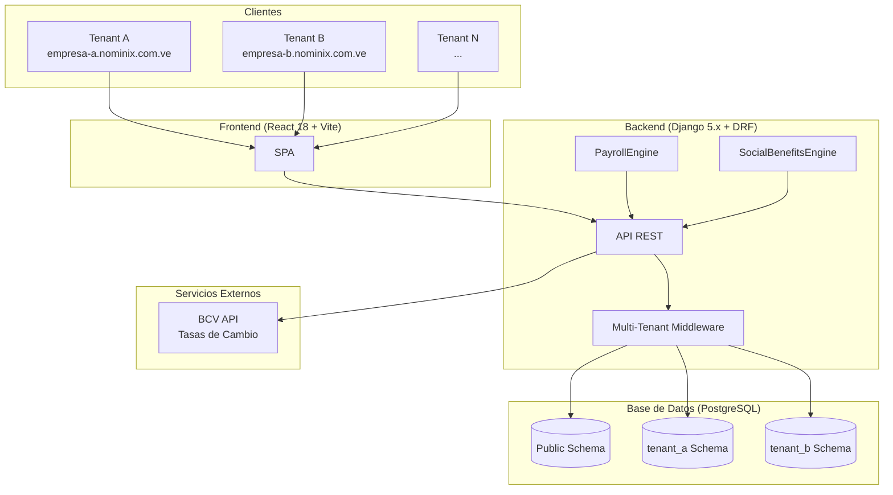
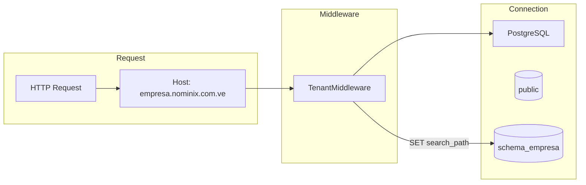
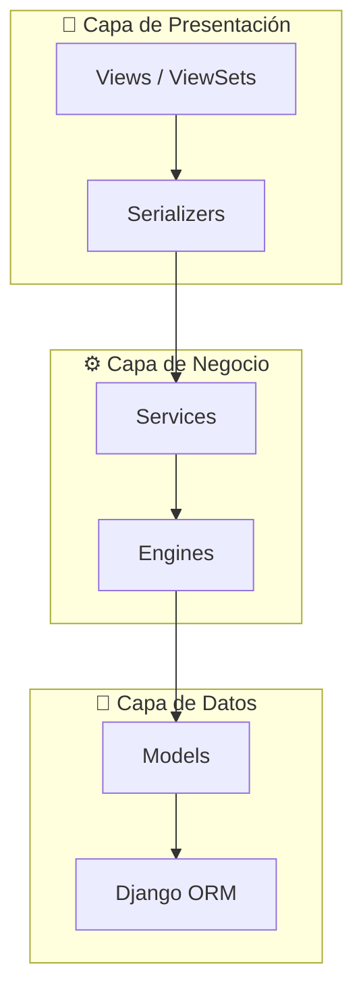
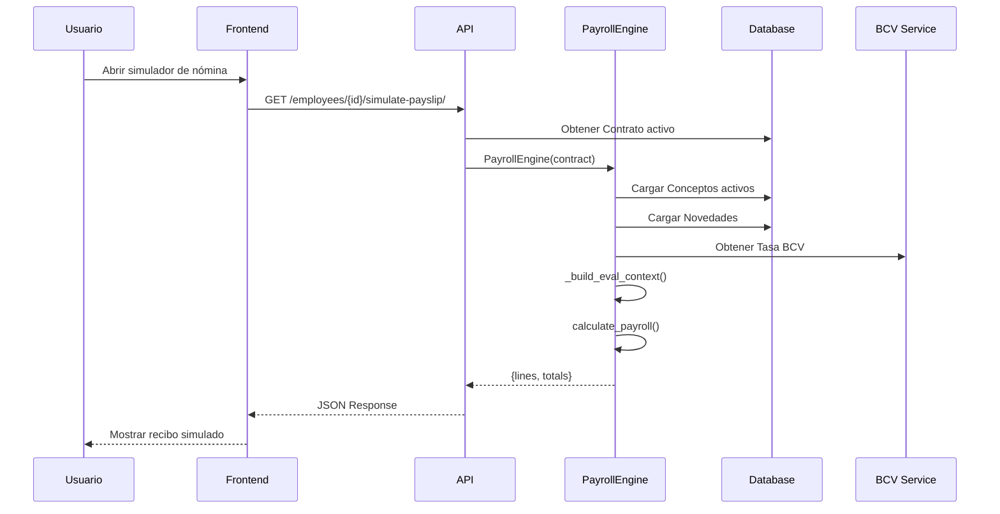
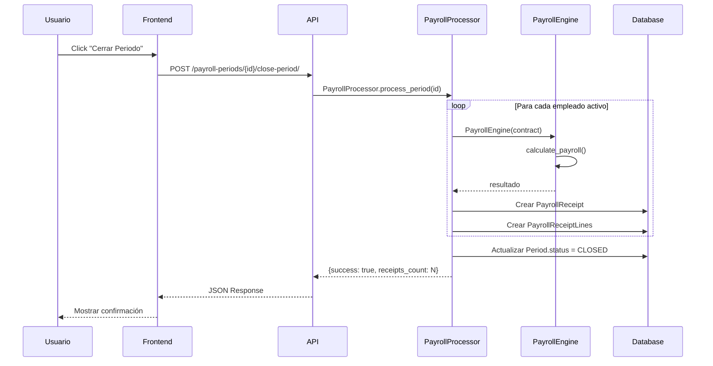
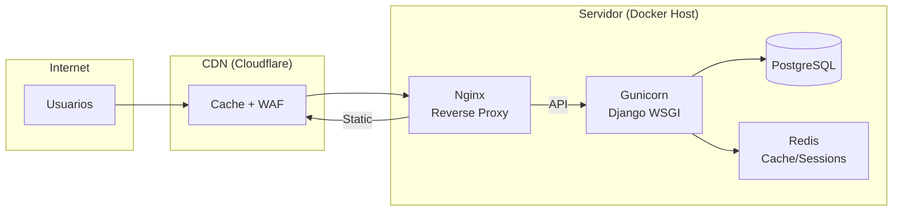
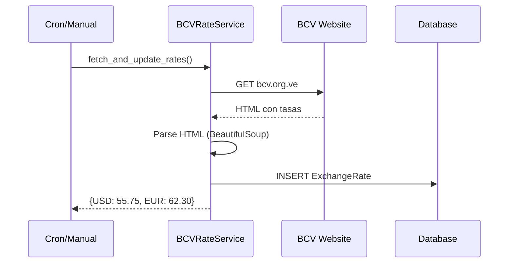

# 🏗️ Arquitectura del Sistema — Nóminix Suite

> Documentación de la arquitectura técnica completa del sistema de gestión de nómina y recursos humanos.
> **Versión:** 2.0.0 | **Última Actualización:** Enero 2026

---

## 📋 Índice

1. [Visión General](#visión-general)
2. [Stack Tecnológico](#stack-tecnológico)
3. [Arquitectura Multi-Tenant](#arquitectura-multi-tenant)
4. [Backend Architecture](#backend-architecture)
5. [Frontend Architecture](#frontend-architecture)
6. [Flujo de Datos](#flujo-de-datos)
7. [Infraestructura](#infraestructura)
8. [Seguridad](#seguridad)
9. [Integraciones Externas](#integraciones-externas)

---

## Visión General

Nóminix es una plataforma **SaaS multi-tenant** para gestión de nómina y recursos humanos, optimizada para el marco legal venezolano.

### Diagrama de Alto Nivel



---

## Stack Tecnológico

### Backend

| Componente | Tecnología | Versión |
|------------|------------|---------|
| **Runtime** | Python | 3.11+ |
| **Framework** | Django | 5.x |
| **API Layer** | Django REST Framework | 3.14+ |
| **Multi-Tenancy** | django-tenants | 3.6+ |
| **Expresiones Dinámicas** | simpleeval | 0.9.13 |
| **PDF Generation** | WeasyPrint | 60.0+ |
| **Data Export** | openpyxl, pandas | Latest |
| **Web Scraping (BCV)** | requests, BeautifulSoup | Latest |

### Frontend

| Componente | Tecnología | Versión |
|------------|------------|---------|
| **Framework** | React | 18.x |
| **Build Tool** | Vite | 5.x |
| **State Management** | TanStack Query | 5.x |
| **Forms** | React Hook Form | 7.x |
| **Routing** | React Router | 6.x |
| **HTTP Client** | Axios | 1.x |
| **Charts** | Recharts | 2.x |

### Infraestructura

| Componente | Tecnología |
|------------|------------|
| **Containerization** | Docker + Docker Compose |
| **Database** | PostgreSQL 15+ |
| **Web Server** | Nginx (reverse proxy) |
| **WSGI Server** | Gunicorn |
| **SSL/TLS** | Let's Encrypt |

---

## Arquitectura Multi-Tenant

Nóminix implementa **aislamiento de datos por schema** usando `django-tenants`.

### Modelo de Tenancy



### Tablas Compartidas (Public Schema)

| Tabla | Descripción |
|-------|-------------|
| `customers_tenant` | Registro de tenants |
| `customers_domain` | Dominios asociados |
| `shared_currency` | Monedas (USD, VES, EUR) |
| `shared_interestratebcv` | Tasas de interés BCV |

### Tablas Aisladas (Tenant Schema)

| Tabla | Descripción |
|-------|-------------|
| `payroll_core_employee` | Empleados |
| `payroll_core_laborcontract` | Contratos laborales |
| `payroll_core_payrollperiod` | Periodos de nómina |
| `payroll_core_payrollreceipt` | Recibos de pago |
| `payroll_core_socialbenefitsledger` | Libro mayor de prestaciones |
| ... | (Todas las tablas de negocio) |

### Configuración de Tenant

```python
# customers/models.py
from django_tenants.models import TenantMixin, DomainMixin

class Tenant(TenantMixin):
    name = models.CharField(max_length=100)
    rif = models.CharField(max_length=15, unique=True)
    address = models.TextField(blank=True)
    status = models.CharField(choices=STATUS_CHOICES)
    created_on = models.DateField(auto_now_add=True)
    
    auto_create_schema = True

class Domain(DomainMixin):
    pass
```

---

## Backend Architecture

### Estructura de Directorios

```
rrhh/
├── config/                    # Configuración Django
│   ├── settings/
│   │   ├── base.py           # Settings compartidos
│   │   ├── development.py    # Config desarrollo
│   │   └── production.py     # Config producción
│   ├── urls.py               # Router principal
│   └── wsgi.py
├── customers/                 # App de multi-tenancy
│   ├── models.py             # Tenant, Domain
│   └── views.py              # TenantViewSet
├── payroll_core/             # App principal de nómina
│   ├── models/               # Modelos (por dominio)
│   │   ├── __init__.py
│   │   ├── employee.py
│   │   ├── organization.py
│   │   ├── concepts.py
│   │   ├── payroll.py
│   │   ├── social_benefits.py
│   │   ├── loans.py
│   │   └── currency.py
│   ├── services/             # Lógica de negocio
│   │   ├── __init__.py
│   │   ├── salary.py         # SalarySplitter
│   │   ├── currency.py       # BCVRateService
│   │   ├── payroll.py        # PayrollProcessor
│   │   ├── social_benefits_engine.py
│   │   └── employee.py
│   ├── engine.py             # PayrollEngine principal
│   ├── formulas.py           # Fórmulas predefinidas
│   ├── views.py              # ViewSets (API)
│   ├── serializers.py        # Serializadores DRF
│   ├── urls.py               # Rutas de la app
│   └── admin.py
├── shared/                    # Modelos compartidos
│   └── models.py             # Currency, etc.
├── templates/                 # Templates HTML
│   └── payroll/
│       └── payslip_batch.html
├── manage.py
├── requirements.txt
└── Dockerfile
```

### Patrón de Capas



### Service Layer Pattern

Las vistas delegan **toda la lógica de negocio** a los servicios:

```python
# Correcto ✅
class EmployeeViewSet(viewsets.ModelViewSet):
    @action(detail=True, methods=['post'])
    def simulate_payslip(self, request, pk=None):
        employee = self.get_object()
        # Delegar al Engine
        engine = PayrollEngine(contract=employee.active_contract)
        result = engine.calculate_payroll()
        return Response(result)

# Incorrecto ❌
class EmployeeViewSet(viewsets.ModelViewSet):
    @action(detail=True, methods=['post'])
    def simulate_payslip(self, request, pk=None):
        employee = self.get_object()
        # NO hacer cálculos en la vista
        salary = employee.salary * 0.04  # ❌
        # ...
```

---

## Frontend Architecture

### Estructura de Directorios

```
nominix-web/
├── src/
│   ├── api/                   # Cliente Axios
│   │   └── client.js
│   ├── components/            # Componentes reutilizables
│   │   ├── ui/               # Atomic Design (Button, Card, Modal)
│   │   └── layout/           # Header, Sidebar, Layout
│   ├── features/              # Módulos por dominio
│   │   ├── auth/
│   │   ├── hr/               # Empleados
│   │   ├── payroll/          # Nómina
│   │   ├── social-benefits/  # Prestaciones
│   │   ├── settings/         # Configuración
│   │   └── tenants/          # Administración de tenants
│   ├── hooks/                 # React Query hooks
│   │   ├── useEmployees.js
│   │   ├── usePayroll.js
│   │   ├── useOrganization.js
│   │   ├── useSocialBenefits.js
│   │   └── index.js
│   ├── utils/                 # Funciones auxiliares
│   │   ├── formatters.js     # formatCurrency, formatDate
│   │   └── validators.js
│   ├── App.jsx               # Router principal
│   └── main.jsx              # Entry point
├── public/
├── index.html
├── vite.config.js
└── package.json
```

### Patrón de Features

Cada **feature** contiene todo lo necesario para su dominio:

```
features/payroll/
├── components/
│   ├── PayrollPeriodList.jsx
│   ├── PayrollPreview.jsx
│   ├── PayslipCard.jsx
│   └── ConceptFormBuilder.jsx
├── pages/
│   ├── PayrollDashboard.jsx
│   └── PayrollPeriodDetail.jsx
└── services/
    └── payrollService.js
```

### Estado del Servidor (TanStack Query)

```javascript
// hooks/usePayroll.js
import { useQuery, useMutation, useQueryClient } from '@tanstack/react-query';

export const payrollKeys = {
  all: ['payroll'],
  periods: () => [...payrollKeys.all, 'periods'],
  period: (id) => [...payrollKeys.periods(), id],
  preview: (id) => [...payrollKeys.period(id), 'preview'],
};

export function usePayrollPeriods(filters = {}) {
  return useQuery({
    queryKey: payrollKeys.periods(),
    queryFn: () => api.get('/payroll-periods/', { params: filters }),
    staleTime: 5 * 60 * 1000, // 5 minutos
  });
}

export function useClosePeriod() {
  const queryClient = useQueryClient();
  
  return useMutation({
    mutationFn: ({ periodId, exchangeRate }) => 
      api.post(`/payroll-periods/${periodId}/close-period/`, { 
        manual_rate: exchangeRate 
      }),
    onSuccess: () => {
      queryClient.invalidateQueries({ queryKey: payrollKeys.periods() });
    },
  });
}
```

---

## Flujo de Datos

### Flujo de Cálculo de Nómina



### Flujo de Cierre de Periodo



---

## Infraestructura

### Docker Compose (Desarrollo)

```yaml
# docker-compose.yml
version: '3.8'

services:
  db:
    image: postgres:15
    volumes:
      - postgres_data:/var/lib/postgresql/data
    environment:
      - POSTGRES_DB=nominix
      - POSTGRES_USER=nominix
      - POSTGRES_PASSWORD=${DB_PASSWORD}
    ports:
      - "5432:5432"

  backend:
    build: .
    command: python manage.py runserver 0.0.0.0:8000
    volumes:
      - .:/app
    ports:
      - "8000:8000"
    depends_on:
      - db
    environment:
      - DATABASE_URL=postgres://nominix:${DB_PASSWORD}@db:5432/nominix
      - DJANGO_SETTINGS_MODULE=config.settings.development

  frontend:
    build: ./nominix-web
    command: npm run dev -- --host
    volumes:
      - ./nominix-web:/app
      - /app/node_modules
    ports:
      - "5173:5173"
    environment:
      - VITE_API_URL=http://localhost:8000

volumes:
  postgres_data:
```

### Arquitectura de Producción



---

## Seguridad

### Autenticación

| Método | Uso |
|--------|-----|
| **Session + CSRF** | Frontend web (Cookie-based) |
| **Token (DRF Token)** | Integraciones terceros (API Key) |

### Configuración CORS

```python
# settings/base.py
CORS_ALLOWED_ORIGINS = [
    "https://nominix.com.ve",
    "https://*.nominix.com.ve",
]

CSRF_TRUSTED_ORIGINS = [
    "https://nominix.com.ve",
    "https://*.nominix.com.ve",
]
```

### Headers de Seguridad

```python
SECURE_BROWSER_XSS_FILTER = True
SECURE_CONTENT_TYPE_NOSNIFF = True
X_FRAME_OPTIONS = 'DENY'
SECURE_HSTS_SECONDS = 31536000  # 1 año
SECURE_HSTS_INCLUDE_SUBDOMAINS = True
```

### Precisión Decimal

> [!WARNING]
> **NUNCA** usar `float` para valores monetarios.

```python
# Correcto ✅
from decimal import Decimal
salary = Decimal('500.00')
ivss = salary * Decimal('0.04')

# Incorrecto ❌
salary = 500.00  # float
ivss = salary * 0.04  # Errores de precisión
```

---

## Integraciones Externas

### BCV (Banco Central de Venezuela)

Servicio que obtiene la tasa oficial USD/VES:

```python
# services/currency.py
class BCVRateService:
    BCV_URL = "https://www.bcv.org.ve/"
    
    @staticmethod
    def fetch_and_update_rates():
        """
        Hace scraping a la página del BCV para obtener tasas.
        Guarda en ExchangeRate model.
        """
        response = requests.get(BCVRateService.BCV_URL)
        soup = BeautifulSoup(response.text, 'html.parser')
        # ... parsing logic ...
        
        ExchangeRate.objects.create(
            currency=usd,
            rate=Decimal(rate_value),
            date_valid=timezone.now(),
            source='BCV'
        )
```

### Flujo de Actualización de Tasas



---

## Referencias

- **Backend Entry**: [config/urls.py](file:///c:/Desarrollo/RRHH/config/urls.py)
- **Frontend Entry**: [nominix-web/src/main.jsx](file:///c:/Desarrollo/RRHH/nominix-web/src/main.jsx)
- **Docker Config**: [docker-compose.yml](file:///c:/Desarrollo/RRHH/docker-compose.yml)
- **Tenant Models**: [customers/models.py](file:///c:/Desarrollo/RRHH/customers/models.py)

---

*© 2026 NÓMINIX Suite — Documentación de Arquitectura*
