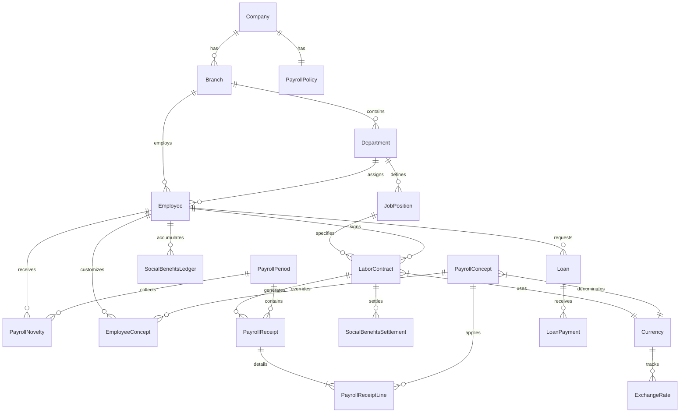

# 🗃️ Esquema de Base de Datos — Nóminix Suite

> Documentación completa de modelos, relaciones y estructura de datos.
> **Versión:** 2.0.0 | **Última Actualización:** Enero 2026

---

## 📋 Índice

1. [Diagrama Entidad-Relación](#diagrama-entidad-relación)
2. [Modelos por Dominio](#modelos-por-dominio)
3. [Organización](#organización)
4. [Empleados y Contratos](#empleados-y-contratos)
5. [Conceptos de Nómina](#conceptos-de-nómina)
6. [Periodos y Recibos](#periodos-y-recibos)
7. [Prestaciones Sociales](#prestaciones-sociales)
8. [Préstamos](#préstamos)
9. [Monedas y Tasas](#monedas-y-tasas)
10. [Multi-Tenancy](#multi-tenancy)

---

## Diagrama Entidad-Relación



---

## Modelos por Dominio

### Distribución de Archivos

| Dominio | Archivo | Modelos |
|---------|---------|---------|
| Organización | `organization.py` | Company, PayrollPolicy, Branch, Department, JobPosition |
| Empleados | `employee.py` | Employee, LaborContract |
| Conceptos | `concepts.py` | PayrollConcept, EmployeeConcept |
| Nómina | `payroll.py` | PayrollPeriod, PayrollReceipt, PayrollReceiptLine, PayrollNovelty |
| Prestaciones | `social_benefits.py` | SocialBenefitsLedger, SocialBenefitsSettlement |
| Préstamos | `loans.py` | Loan, LoanPayment |
| Monedas | `currency.py` | Currency, ExchangeRate, InterestRateBCV |

---

## Organización

### Company (Empresa)

Modelo **singleton** que almacena la configuración global de la empresa.

```python
class Company(models.Model):
    # Identificación
    name = models.CharField(max_length=200)
    rif = models.CharField(max_length=15)
    address = models.TextField(blank=True)
    phone = models.CharField(max_length=20, blank=True)
    email = models.EmailField(blank=True)
    logo = models.ImageField(upload_to='company/', blank=True)
    
    # Configuración Financiera
    base_currency_symbol = models.CharField(max_length=3, default='USD')
    national_minimum_salary = models.DecimalField(
        max_digits=12, decimal_places=2, default=Decimal('130.00')
    )
    
    # Ingeniería Salarial
    salary_split_mode = models.CharField(
        max_length=15,
        choices=SalarySplitMode.choices,
        default=SalarySplitMode.PERCENTAGE
    )
    split_percentage_base = models.DecimalField(
        max_digits=5, decimal_places=2, default=Decimal('30.00')
    )
    
    # Cestaticket
    cestaticket_amount_usd = models.DecimalField(
        max_digits=10, decimal_places=2, default=Decimal('40.00')
    )
```

| Campo | Tipo | Descripción |
|-------|------|-------------|
| `name` | CharField(200) | Razón social |
| `rif` | CharField(15) | RIF de la empresa |
| `salary_split_mode` | Choices | Modo de partición salarial |
| `split_percentage_base` | Decimal(5,2) | Porcentaje de base (si aplica) |
| `national_minimum_salary` | Decimal(12,2) | Salario mínimo nacional |
| `cestaticket_amount_usd` | Decimal(10,2) | Monto cestaticket en USD |

---

### PayrollPolicy (Políticas de Nómina)

Factores y multiplicadores para cálculos de nómina.

```python
class PayrollPolicy(models.Model):
    company = models.OneToOneField(Company, on_delete=models.CASCADE)
    
    # Factores de Ley
    factor_dias_utilidades = models.DecimalField(default=Decimal('30'))
    factor_dias_bono_vacacional = models.DecimalField(default=Decimal('15'))
    factor_dias_vacaciones = models.DecimalField(default=Decimal('15'))
    
    # Multiplicadores
    overtime_multiplier = models.DecimalField(default=Decimal('1.50'))
    sunday_multiplier = models.DecimalField(default=Decimal('1.50'))
    holiday_multiplier = models.DecimalField(default=Decimal('2.00'))
    night_multiplier = models.DecimalField(default=Decimal('1.30'))
    
    # Deducciones de Ley
    ivss_employee_rate = models.DecimalField(default=Decimal('4.00'))
    ivss_employer_rate = models.DecimalField(default=Decimal('12.00'))
    faov_employee_rate = models.DecimalField(default=Decimal('1.00'))
    faov_employer_rate = models.DecimalField(default=Decimal('2.00'))
    rpe_employee_rate = models.DecimalField(default=Decimal('0.50'))
    inces_rate = models.DecimalField(default=Decimal('2.00'))
```

| Campo | Tipo | Default | Descripción |
|-------|------|---------|-------------|
| `factor_dias_utilidades` | Decimal | 30 | Días para cálculo de utilidades |
| `overtime_multiplier` | Decimal | 1.50 | Multiplicador horas extra |
| `holiday_multiplier` | Decimal | 2.00 | Multiplicador días feriados |
| `ivss_employee_rate` | Decimal | 4.00 | Tasa IVSS empleado (%) |

---

### Branch (Sede)

```python
class Branch(models.Model):
    name = models.CharField(max_length=100)
    code = models.CharField(max_length=10, unique=True)
    address = models.TextField(blank=True)
    phone = models.CharField(max_length=20, blank=True)
    is_active = models.BooleanField(default=True)
```

---

### Department (Departamento)

```python
class Department(models.Model):
    branch = models.ForeignKey(Branch, on_delete=models.CASCADE)
    name = models.CharField(max_length=100)
    code = models.CharField(max_length=10)
    manager = models.ForeignKey('Employee', null=True, blank=True)
    
    class Meta:
        unique_together = ['branch', 'code']
```

---

### JobPosition (Cargo)

```python
class JobPosition(models.Model):
    department = models.ForeignKey(Department, on_delete=models.CASCADE)
    name = models.CharField(max_length=100)
    code = models.CharField(max_length=20, unique=True)
    
    # Salario base del cargo
    base_salary_amount = models.DecimalField(max_digits=12, decimal_places=2)
    base_salary_currency = models.ForeignKey(Currency, on_delete=models.PROTECT)
    
    # Ingeniería salarial
    split_fixed_amount = models.DecimalField(default=Decimal('0.00'))
    split_fixed_currency = models.ForeignKey(Currency, null=True)
```

---

## Empleados y Contratos

### Employee (Empleado)

```python
class Employee(models.Model):
    # Personal
    first_name = models.CharField(max_length=100)
    last_name = models.CharField(max_length=100)
    national_id = models.CharField(max_length=15, unique=True)  # Cédula
    birth_date = models.DateField()
    gender = models.CharField(max_length=1, choices=GENDER_CHOICES)
    marital_status = models.CharField(max_length=20)
    
    # Identificación Venezuela
    id_type = models.CharField(choices=[('V', 'Venezolano'), ('E', 'Extranjero')])
    rif = models.CharField(max_length=15, blank=True)  # RIF personal
    ivss_code = models.CharField(max_length=20, blank=True)  # Número IVSS
    faov_code = models.CharField(max_length=20, blank=True)  # Número FAOV
    
    # Contacto
    email = models.EmailField(blank=True)
    phone = models.CharField(max_length=20, blank=True)
    address = models.TextField(blank=True)
    
    # Bancario
    bank_name = models.CharField(max_length=100, blank=True)
    bank_account_type = models.CharField(max_length=20, blank=True)
    bank_account_number = models.CharField(max_length=30, blank=True)
    
    # Laboral (denormalized for quick access)
    branch = models.ForeignKey(Branch, null=True)
    department = models.ForeignKey(Department, null=True)
    position = models.ForeignKey(JobPosition, null=True)
    hire_date = models.DateField()
    termination_date = models.DateField(null=True, blank=True)
    is_active = models.BooleanField(default=True)
    
    # Calculado
    @property
    def full_name(self):
        return f"{self.first_name} {self.last_name}"
    
    @property
    def seniority_years(self):
        """Años de antigüedad cumplidos."""
        delta = date.today() - self.hire_date
        return delta.days // 365
```

| Campo | Tipo | Descripción |
|-------|------|-------------|
| `national_id` | CharField(15) | Cédula (V-12345678) |
| `ivss_code` | CharField(20) | Número de Seguro Social |
| `faov_code` | CharField(20) | Número FAOV |
| `hire_date` | DateField | Fecha de ingreso |
| `seniority_years` | Property | Años de antigüedad |

---

### LaborContract (Contrato Laboral)

```python
class LaborContract(models.Model):
    class ContractType(models.TextChoices):
        INDEFINIDO = 'INDEFINIDO', 'Tiempo Indeterminado'
        DETERMINADO = 'DETERMINADO', 'Tiempo Determinado'
        OBRA = 'OBRA', 'Obra Determinada'
    
    class PaymentFrequency(models.TextChoices):
        QUINCENAL = 'QUINCENAL', 'Quincenal'
        MENSUAL = 'MENSUAL', 'Mensual'
        SEMANAL = 'SEMANAL', 'Semanal'
    
    employee = models.ForeignKey(Employee, on_delete=models.CASCADE)
    position = models.ForeignKey(JobPosition, on_delete=models.PROTECT)
    branch = models.ForeignKey(Branch, on_delete=models.PROTECT)
    
    # Tipo y vigencia
    contract_type = models.CharField(choices=ContractType.choices)
    payment_frequency = models.CharField(choices=PaymentFrequency.choices)
    start_date = models.DateField()
    end_date = models.DateField(null=True, blank=True)
    is_active = models.BooleanField(default=True)
    
    # Salario
    salary_amount = models.DecimalField(max_digits=12, decimal_places=2)
    salary_currency = models.ForeignKey(Currency, on_delete=models.PROTECT)
    
    # Override del total (opcional)
    total_salary_override = models.DecimalField(null=True, blank=True)
    
    @property
    def monthly_salary(self):
        """Salario mensual consolidado."""
        if self.total_salary_override:
            return self.total_salary_override
        return self.salary_amount
```

| Campo | Tipo | Descripción |
|-------|------|-------------|
| `contract_type` | Choices | INDEFINIDO, DETERMINADO, OBRA |
| `payment_frequency` | Choices | QUINCENAL, MENSUAL, SEMANAL |
| `salary_amount` | Decimal | Monto base del contrato |
| `salary_currency` | FK(Currency) | Moneda del salario |
| `total_salary_override` | Decimal | Override del total pactado |

> [!IMPORTANT]
> Solo puede existir **un contrato activo** por empleado. El método `save()` valida esto automáticamente.

---

## Conceptos de Nómina

### PayrollConcept (Concepto de Nómina)

```python
class PayrollConcept(models.Model):
    class ConceptKind(models.TextChoices):
        EARNING = 'EARNING', 'Asignación'
        DEDUCTION = 'DEDUCTION', 'Deducción'
    
    class ComputationMethod(models.TextChoices):
        FIXED = 'FIXED', 'Monto Fijo'
        PERCENTAGE = 'PERCENTAGE', 'Porcentaje de Base'
        FORMULA = 'FORMULA', 'Fórmula Dinámica'
    
    class ConceptBehavior(models.TextChoices):
        SALARY_BASE = 'SALARY_BASE', 'Sueldo Base'
        CESTATICKET = 'CESTATICKET', 'Cestaticket'
        COMPLEMENT = 'COMPLEMENT', 'Complemento Salarial'
        LAW_DEDUCTION = 'LAW_DEDUCTION', 'Deducción de Ley'
        LOAN = 'LOAN', 'Préstamo'
        DYNAMIC = 'DYNAMIC', 'Fórmula Dinámica'
        FIXED = 'FIXED', 'Monto Fijo'
    
    class CalculationBase(models.TextChoices):
        SALARY_BASE = 'SALARY_BASE', 'Sueldo Base'
        SALARY_TOTAL = 'SALARY_TOTAL', 'Salario Total'
        ACCUMULATOR = 'ACCUMULATOR', 'Acumulador'
    
    # Identificación
    code = models.CharField(max_length=30, unique=True)
    name = models.CharField(max_length=100)
    description = models.TextField(blank=True)
    
    # Clasificación
    kind = models.CharField(choices=ConceptKind.choices)
    behavior = models.CharField(choices=ConceptBehavior.choices)
    computation_method = models.CharField(choices=ComputationMethod.choices)
    calculation_base = models.CharField(choices=CalculationBase.choices, null=True)
    
    # Valores
    fixed_amount = models.DecimalField(default=Decimal('0.00'))
    percentage_value = models.DecimalField(default=Decimal('0.00'))
    formula = models.TextField(blank=True)
    currency = models.ForeignKey(Currency, null=True)
    
    # Parámetros de Sistema (JSON)
    system_params = models.JSONField(default=dict)
    
    # Incidencias (qué acumuladores afecta)
    incidences = models.JSONField(default=list)
    
    # Visualización
    appears_on_receipt = models.BooleanField(default=True)
    show_even_if_zero = models.BooleanField(default=False)
    receipt_order = models.PositiveIntegerField(default=100)
    tipo_recibo = models.CharField(default='salario')  # salario, complemento, cestaticket
    
    # Estado
    is_system = models.BooleanField(default=False)
    active = models.BooleanField(default=True)
```

| Campo | Tipo | Descripción |
|-------|------|-------------|
| `code` | CharField(30) | Código único (ej: SUELDO_BASE) |
| `behavior` | Choices | Determina el handler del motor |
| `formula` | TextField | Fórmula dinámica (si aplica) |
| `incidences` | JSONField | Lista de acumuladores afectados |
| `system_params` | JSONField | Parámetros específicos por behavior |

### Ejemplo de system_params

```json
// Para LAW_DEDUCTION (IVSS)
{
    "rate": "4.00",
    "base_source": "IVSS",
    "cap_multiplier": "5",
    "use_lunes": true
}

// Para DYNAMIC (Horas Extra)
{
    "requires_novelty": true,
    "novelty_key": "H_EXTRA"
}
```

---

### EmployeeConcept (Concepto por Empleado)

Override de valores para un empleado específico.

```python
class EmployeeConcept(models.Model):
    employee = models.ForeignKey(Employee, on_delete=models.CASCADE)
    concept = models.ForeignKey(PayrollConcept, on_delete=models.CASCADE)
    
    # Valores personalizados
    custom_fixed_amount = models.DecimalField(null=True, blank=True)
    custom_percentage = models.DecimalField(null=True, blank=True)
    custom_formula = models.TextField(blank=True)
    
    is_active = models.BooleanField(default=True)
    notes = models.TextField(blank=True)
    
    class Meta:
        unique_together = ['employee', 'concept']
```

---

## Periodos y Recibos

### PayrollPeriod (Periodo de Nómina)

```python
class PayrollPeriod(models.Model):
    class PeriodStatus(models.TextChoices):
        DRAFT = 'DRAFT', 'Borrador'
        OPEN = 'OPEN', 'Abierto'
        PROCESSING = 'PROCESSING', 'Procesando'
        CLOSED = 'CLOSED', 'Cerrado'
    
    class PeriodType(models.TextChoices):
        QUINCENAL_1 = 'Q1', 'Primera Quincena'
        QUINCENAL_2 = 'Q2', 'Segunda Quincena'
        MENSUAL = 'M', 'Mensual'
        ESPECIAL = 'E', 'Especial'
    
    name = models.CharField(max_length=100)
    period_type = models.CharField(choices=PeriodType.choices)
    start_date = models.DateField()
    end_date = models.DateField()
    payment_date = models.DateField()
    status = models.CharField(choices=PeriodStatus.choices, default='DRAFT')
    
    # Metadata de cierre
    closed_at = models.DateTimeField(null=True)
    closed_by = models.ForeignKey(User, null=True)
    notes = models.TextField(blank=True)
```

---

### PayrollReceipt (Recibo de Pago)

```python
class PayrollReceipt(models.Model):
    period = models.ForeignKey(PayrollPeriod, on_delete=models.PROTECT, related_name='receipts')
    employee = models.ForeignKey(Employee, on_delete=models.PROTECT)
    
    # Snapshot del contrato al momento del cierre
    contract_snapshot = models.JSONField()
    
    # Totales
    total_earnings_ves = models.DecimalField(max_digits=18, decimal_places=2)
    total_deductions_ves = models.DecimalField(max_digits=18, decimal_places=2)
    net_pay_ves = models.DecimalField(max_digits=18, decimal_places=2)
    
    # Referencia USD
    total_earnings_usd = models.DecimalField(max_digits=12, decimal_places=2, null=True)
    total_deductions_usd = models.DecimalField(max_digits=12, decimal_places=2, null=True)
    net_pay_usd = models.DecimalField(max_digits=12, decimal_places=2, null=True)
    
    # Tasa aplicada (inmutable)
    exchange_rate_applied = models.DecimalField(max_digits=12, decimal_places=4)
    currency_code = models.CharField(max_length=3, default='USD')
    
    # Auditoría
    created_at = models.DateTimeField(auto_now_add=True)
    
    class Meta:
        unique_together = ['period', 'employee']
```

> [!IMPORTANT]
> El `contract_snapshot` almacena los datos del contrato al momento del cierre, garantizando que los recibos históricos no cambien si el contrato se modifica posteriormente.

---

### PayrollReceiptLine (Detalle del Recibo)

```python
class PayrollReceiptLine(models.Model):
    receipt = models.ForeignKey(PayrollReceipt, on_delete=models.CASCADE, related_name='lines')
    
    # Concepto aplicado
    concept_code = models.CharField(max_length=30)
    concept_name = models.CharField(max_length=100)
    kind = models.CharField(choices=[('EARNING', 'Asignación'), ('DEDUCTION', 'Deducción')])
    
    # Valores
    quantity = models.DecimalField(default=Decimal('1'))
    unit = models.CharField(max_length=20, default='Mes')
    amount_ves = models.DecimalField(max_digits=18, decimal_places=2)
    amount_usd = models.DecimalField(max_digits=12, decimal_places=2, null=True)
    
    # Clasificación para recibos separados
    tipo_recibo = models.CharField(max_length=20, default='salario')
    
    # Trazabilidad
    calculation_trace = models.TextField(blank=True)
    formula_used = models.TextField(blank=True)
```

---

### PayrollNovelty (Novedad de Nómina)

```python
class PayrollNovelty(models.Model):
    employee = models.ForeignKey(Employee, on_delete=models.CASCADE)
    period = models.ForeignKey(PayrollPeriod, on_delete=models.CASCADE)
    concept_code = models.CharField(max_length=30)
    
    amount = models.DecimalField(max_digits=12, decimal_places=2)
    notes = models.TextField(blank=True)
    
    created_at = models.DateTimeField(auto_now_add=True)
    created_by = models.ForeignKey(User, null=True)
    
    class Meta:
        unique_together = ['employee', 'period', 'concept_code']
```

---

## Prestaciones Sociales

### SocialBenefitsLedger (Libro Mayor de Prestaciones)

```python
class SocialBenefitsLedger(models.Model):
    class TransactionType(models.TextChoices):
        GARANTIA = 'GARANTIA', 'Garantía Trimestral'
        DIAS_ADIC = 'DIAS_ADIC', 'Días Adicionales'
        INTERES = 'INTERES', 'Intereses'
        ANTICIPO = 'ANTICIPO', 'Anticipo'
        LIQUIDACION = 'LIQUIDACION', 'Liquidación'
        REVERSAL = 'REVERSAL', 'Reversión'
    
    employee = models.ForeignKey(Employee, on_delete=models.PROTECT)
    contract = models.ForeignKey(LaborContract, on_delete=models.PROTECT)
    
    transaction_type = models.CharField(choices=TransactionType.choices)
    transaction_date = models.DateField()
    period_description = models.CharField(max_length=50)
    
    # Cálculo
    basis_days = models.DecimalField(max_digits=6, decimal_places=2, default=Decimal('0'))
    daily_salary_used = models.DecimalField(max_digits=12, decimal_places=2, default=Decimal('0'))
    interest_rate_used = models.DecimalField(max_digits=6, decimal_places=4, null=True)
    
    # Saldos
    previous_balance = models.DecimalField(max_digits=14, decimal_places=2)
    amount = models.DecimalField(max_digits=14, decimal_places=2)
    balance = models.DecimalField(max_digits=14, decimal_places=2)
    
    # Trazabilidad
    calculation_formula = models.CharField(max_length=200)
    calculation_trace = models.TextField()
    
    # Auditoría
    created_at = models.DateTimeField(auto_now_add=True)
    created_by = models.CharField(max_length=100)
    ip_address = models.GenericIPAddressField(null=True)
    notes = models.TextField(blank=True)
```

> [!CAUTION]
> Este modelo es **INMUTABLE**. Los métodos `save()` y `delete()` están bloqueados para registros existentes. Las correcciones se hacen mediante transacciones `REVERSAL`.

---

### SocialBenefitsSettlement (Liquidación de Prestaciones)

```python
class SocialBenefitsSettlement(models.Model):
    class SettlementMethod(models.TextChoices):
        GARANTIA = 'GARANTIA', 'Por Garantía (Art. 142 lit. c)'
        RETROACTIVO = 'RETROACTIVO', 'Retroactivo (Art. 142 lit. d)'
    
    employee = models.ForeignKey(Employee, on_delete=models.PROTECT)
    contract = models.ForeignKey(LaborContract, on_delete=models.PROTECT)
    
    termination_date = models.DateField()
    
    # Método A: Garantía
    total_garantia = models.DecimalField(max_digits=14, decimal_places=2)
    total_dias_adicionales = models.DecimalField(max_digits=14, decimal_places=2)
    total_intereses = models.DecimalField(max_digits=14, decimal_places=2)
    total_anticipos = models.DecimalField(max_digits=14, decimal_places=2)
    net_garantia = models.DecimalField(max_digits=14, decimal_places=2)
    
    # Método B: Retroactivo
    years_of_service = models.DecimalField(max_digits=6, decimal_places=2)
    retroactive_days = models.DecimalField(max_digits=8, decimal_places=2)
    final_daily_salary = models.DecimalField(max_digits=12, decimal_places=2)
    retroactive_amount = models.DecimalField(max_digits=14, decimal_places=2)
    
    # Resultado
    chosen_method = models.CharField(choices=SettlementMethod.choices)
    settlement_amount = models.DecimalField(max_digits=14, decimal_places=2)
    
    # Auditoría
    calculation_summary = models.TextField()
    created_at = models.DateTimeField(auto_now_add=True)
    created_by = models.CharField(max_length=100)
```

---

## Préstamos

### Loan (Préstamo)

```python
class Loan(models.Model):
    class LoanStatus(models.TextChoices):
        PENDIENTE = 'PENDIENTE', 'Pendiente de Aprobación'
        APROBADO = 'APROBADO', 'Aprobado'
        ACTIVO = 'ACTIVO', 'En Deducción'
        PAGADO = 'PAGADO', 'Pagado'
        CANCELADO = 'CANCELADO', 'Cancelado'
    
    employee = models.ForeignKey(Employee, on_delete=models.PROTECT)
    
    # Monto
    amount = models.DecimalField(max_digits=12, decimal_places=2)
    currency = models.ForeignKey(Currency, on_delete=models.PROTECT)
    
    # Términos
    monthly_deduction = models.DecimalField(max_digits=12, decimal_places=2)
    total_installments = models.PositiveIntegerField()
    
    # Estado
    status = models.CharField(choices=LoanStatus.choices, default='PENDIENTE')
    paid_installments = models.PositiveIntegerField(default=0)
    remaining_balance = models.DecimalField(max_digits=12, decimal_places=2)
    
    # Fechas
    request_date = models.DateField(auto_now_add=True)
    approval_date = models.DateField(null=True)
    start_deduction_date = models.DateField(null=True)
    
    notes = models.TextField(blank=True)
```

---

### LoanPayment (Pago de Préstamo)

```python
class LoanPayment(models.Model):
    loan = models.ForeignKey(Loan, on_delete=models.CASCADE, related_name='payments')
    
    payment_date = models.DateField()
    amount = models.DecimalField(max_digits=12, decimal_places=2)
    
    # Referencia al recibo de nómina
    payroll_receipt = models.ForeignKey(PayrollReceipt, null=True)
    
    notes = models.TextField(blank=True)
    created_at = models.DateTimeField(auto_now_add=True)
```

---

## Monedas y Tasas

### Currency (Moneda)

```python
# Modelo COMPARTIDO (public schema)
class Currency(models.Model):
    code = models.CharField(max_length=3, primary_key=True)  # USD, VES, EUR
    name = models.CharField(max_length=50)
    symbol = models.CharField(max_length=5)
    is_base = models.BooleanField(default=False)  # USD es base
```

---

### ExchangeRate (Tasa de Cambio)

```python
class ExchangeRate(models.Model):
    class RateSource(models.TextChoices):
        BCV = 'BCV', 'Banco Central de Venezuela'
        MANUAL = 'MANUAL', 'Ingreso Manual'
    
    currency = models.ForeignKey(Currency, on_delete=models.CASCADE)
    rate = models.DecimalField(max_digits=12, decimal_places=4)
    date_valid = models.DateTimeField()
    source = models.CharField(choices=RateSource.choices, default='BCV')
```

---

### InterestRateBCV (Tasa de Interés BCV)

```python
# Modelo COMPARTIDO (public schema)
class InterestRateBCV(models.Model):
    year = models.PositiveIntegerField()
    month = models.PositiveSmallIntegerField()
    rate = models.DecimalField(max_digits=6, decimal_places=4)  # Ej: 15.5000
    
    class Meta:
        unique_together = ['year', 'month']
```

---

## Multi-Tenancy

### Tenant (Inquilino)

```python
# customers/models.py
from django_tenants.models import TenantMixin, DomainMixin

class Tenant(TenantMixin):
    class TenantStatus(models.TextChoices):
        TRIAL = 'TRIAL', 'En Prueba'
        ACTIVE = 'ACTIVE', 'Activo'
        SUSPENDED = 'SUSPENDED', 'Suspendido'
        CANCELLED = 'CANCELLED', 'Cancelado'
    
    name = models.CharField(max_length=100)
    rif = models.CharField(max_length=15, unique=True)
    address = models.TextField(blank=True)
    status = models.CharField(choices=TenantStatus.choices, default='TRIAL')
    
    # Límites
    max_employees = models.PositiveIntegerField(default=50)
    max_users = models.PositiveIntegerField(default=5)
    
    # Fechas
    created_on = models.DateField(auto_now_add=True)
    paid_until = models.DateField(null=True)
    
    auto_create_schema = True

class Domain(DomainMixin):
    pass
```

---

## Referencias

- **Modelos de Organización**: [organization.py](file:///c:/Desarrollo/RRHH/payroll_core/models/organization.py)
- **Modelos de Empleado**: [employee.py](file:///c:/Desarrollo/RRHH/payroll_core/models/employee.py)
- **Modelos de Nómina**: [payroll.py](file:///c:/Desarrollo/RRHH/payroll_core/models/payroll.py)
- **Modelos de Prestaciones**: [social_benefits.py](file:///c:/Desarrollo/RRHH/payroll_core/models/social_benefits.py)
- **Modelos de Préstamos**: [loans.py](file:///c:/Desarrollo/RRHH/payroll_core/models/loans.py)
- **Modelos de Tenants**: [customers/models.py](file:///c:/Desarrollo/RRHH/customers/models.py)

---

*© 2026 NÓMINIX Suite — Documentación de Esquema de Base de Datos*
