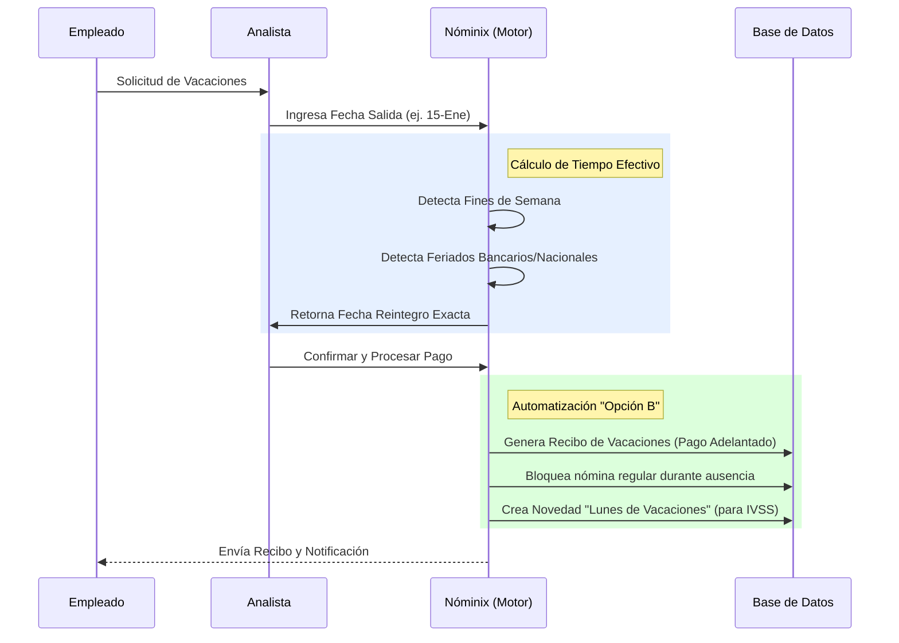
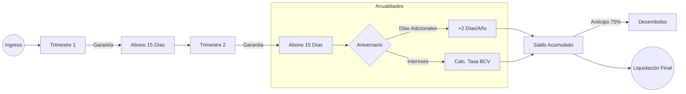
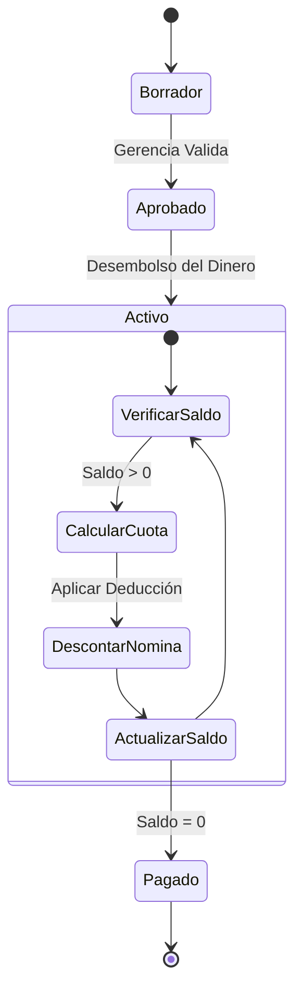

# NÓMINIX: El Estándar Moderno para la Gestión de Nómina en Venezuela
> **Documento Funcional Maestro & Arquitectura de Procesos**  
> *Versión 2.5 - Edición "Caja de Cristal" - Enero 2026*

---

## 📖 1. Visión y Filosofía del Sistema

### 1.1. Arquitectura "Caja de Cristal" vs. "Caja Negra"
Mientras los sistemas tradicionales (Legacy) operan como cajas negras donde el usuario introduce datos y reza por un resultado correcto, **Nóminix** introduce la filosofía de **"Caja de Cristal"**.

*   **Trazabilidad Absoluta:** Cada centavo calculado tiene una "historia". El sistema almacena no solo el resultado final, sino la *fórmula exacta*, las variables usadas (ej. antigüedad al momento del cálculo) y la tasa cambiaria aplicada.
*   **Auditabilidad en Tiempo Real:** Los auditores pueden reconstruir cualquier cálculo del pasado con precisión milimétrica, sin importar si las leyes o sueldos han cambiado desde entonces.

### 1.2. La Solución al Dilema Bimonetario (Moneda Ancla)
Nóminix resuelve nativamente la fricción entre la moneda legal (Bolívares) y la moneda de valor (Dólares):

*   **Contratos en Moneda Dura:** Los sueldos se negocian y definen en USD.
*   **Traducción Dinámica:** Al momento de pagar, el sistema consulta automáticamente la tasa BCV (vía scraping directo del Banco Central) y realiza la conversión.
*   **Preservación de Valor:** Las prestaciones sociales y pasivos se recalculan constantemente para evitar la devaluación del patrimonio del empleado.

---

## 🔄 2. Módulo de Nómina (Payroll Engine)

El corazón del sistema no es una simple calculadora, es un **Motor de Reglas Semánticas** capaz de procesar cientos de empleados en segundos con precisión decimal.

### 2.1. Flujo de Procesamiento

```mermaid
graph TD
    A[Inicio del Periodo] --> B{Carga de Novedades};
    B -->|Manual| C[Faltas, Horas Extra, Bonos];
    B -->|Automático| D[Préstamos, Vacaciones];
    
    C & D --> E[Motor de Cálculo (PayrollEngine)];
    
    subgraph "Caja de Cristal (Procesamiento)"
        E --> F[Construcción de Contexto];
        F --> G[Evaluación de Fórmulas (Python simpleeval)];
        G --> H{Tipo de Concepto};
        H -->|Asignación| I[Suma al Neto];
        H -->|Deducción de Ley| J[Aplica Topes (IVSS, FAOV)];
        H -->|Préstamo| K[Verifica Saldo y Amortiza];
    end
    
    I & J & K --> L[Generación de Recibo Preliminar];
    L --> M{Validación};
    M -->|Error| B;
    M -->|Aprobado| N[Cierre de Periodo (Inmutabilidad)];
    N --> O[Emisión de PDF y Email];
```

### 2.2. Traducción Técnica de Beneficios

*   **Evaluación Contextual:** El motor "sabe" quién es el empleado. Si es un nuevo ingreso, ajusta automáticamente el Bono de Alimentación. Si tiene un préstamo activo, decide cuánto descontar basándose en el saldo restante, no en una cuota fija ciega.
*   **Ingeniería Salarial (Salary Splitter):** El sistema divide matemáticamente el paquete salarial en "Salario Normal" (base para prestaciones) y "Bonificaciones No Salariales", optimizando la carga tributaria de la empresa sin violar la ley.

---

## 🏖️ 3. Módulo de Vacaciones (Gestión Inteligente)

Olvide el calendario de pared y la calculadora. Nóminix gestiona el ciclo completo.

### 3.1. Flujo de Solicitud y Pago ("Opción B")



### 3.2. Beneficios Clave
*   **Prevención de Doble Pago:** Al usar la "Opción B", el sistema automáticamente crea "Novedades de Descuento" en las nóminas futuras que coinciden con el disfrute. Nunca más pagará sueldo Y vacaciones por los mismos días.
*   **Cálculo de Lunes:** Para el IVSS, un empleado de vacaciones sigue cotizando. El sistema calcula cuántos lunes hay en el periodo de vacaciones y genera el aporte automáticamente.

---

## 💰 4. Módulo de Prestaciones Sociales (LOTTT)

El cumplimiento del Art. 142 de la LOTTT es automático. El sistema mantiene un "Libro Mayor" (Ledger) inmutable.

### 4.1. Ciclo de Vida de las Prestaciones



### 4.2. Simulación de Liquidación (El "Duelo" de Métodos)
Al liquidar, el sistema ejecuta dos cálculos paralelos y **paga el mayor**, protegiendo a la empresa de demandas:

1.  **Método A (Garantía):** Suma histórica de trimestres + intereses - anticipos.
2.  **Método B (Retroactivo):** (Años de servicio $\times$ 30 días) $\times$ Último Salario Integral.

*El sistema genera un cuadro comparativo automático para el expediente del egreso.*

---

## 💸 5. Módulo de Préstamos y Cuentas por Cobrar

Gestión financiera integrada a la nómina.

### 5.1. Flujo de Amortización Automática



### 5.2. Características Únicas
*   **Amortización Inteligente:** Si un empleado tiene bajo sueldo en una quincena (por faltas), el sistema puede reajustar la cuota o posponerla (según configuración) para no dejar al trabajador con "Saldo Negativo".
*   **Multimoneda:** Puede otorgar préstamos en Dólares y descontarlos en Bolívares a la tasa del día del pago.

---

## 🏢 6. Multi-Tenancy y Seguridad

### 6.1. Aislamiento de Datos
Nóminix utiliza un esquema de **"Apartamentos Digitales"** (Schemas de PostgreSQL).
*   **Datos Compartidos:** Solo tasas BCV y Tablas de Impuestos (comunes para todos).
*   **Datos Privados:** Empleados, Recibos y Contratos viven en bóvedas separadas. Es físicamente imposible que la Empresa A vea los datos de la Empresa B.

### 6.2. Nota Legal de Cumplimiento
Este sistema ha sido validado para cumplir con:
*   **LOTTT Arts. 122, 131, 142, 192:** Cálculo correcto de salario integral y beneficios.
*   **Providencias del BCV:** Uso obligatorio de tasas oficiales.
*   **Ley de Delitos Informáticos:** Garantía de integridad y no repudio de la data (Logs de Auditoría).

---

> **Nóminix**
> *Tecnología que entiende de leyes. Software que entiende de gente.*
