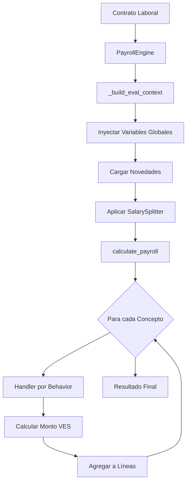
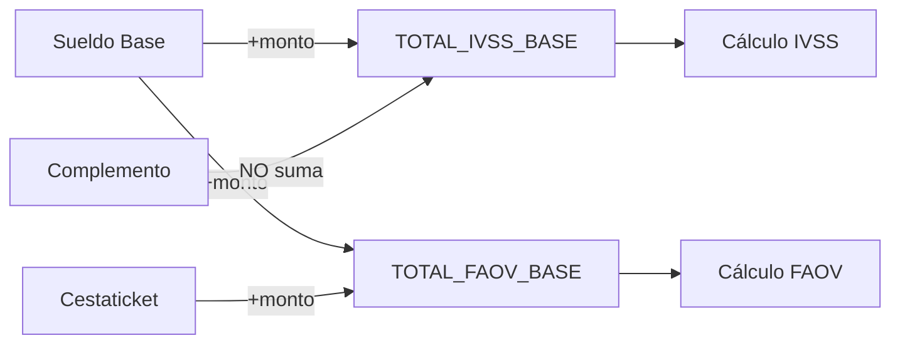

# ⚙️ Motor de Nómina (PayrollEngine) — Documentación Técnica

> Referencia completa del motor de cálculo de nómina de Nóminix Suite.
> **Versión:** 2.0.0 | **Última Actualización:** Enero 2026

---

## 📋 Índice

1. [Arquitectura General](#arquitectura-general)
2. [Inicialización del Motor](#inicialización-del-motor)
3. [Contexto de Evaluación](#contexto-de-evaluación)
4. [Variables Disponibles](#variables-disponibles)
5. [Behaviors de Conceptos](#behaviors-de-conceptos)
6. [Handlers Especializados](#handlers-especializados)
7. [Sistema de Novedades](#sistema-de-novedades)
8. [Acumuladores e Incidencias](#acumuladores-e-incidencias)
9. [Flujo de Cálculo](#flujo-de-cálculo)
10. [Validación de Fórmulas](#validación-de-fórmulas)
11. [Trazabilidad y Auditoría](#trazabilidad-y-auditoría)

---

## Arquitectura General

El `PayrollEngine` es el núcleo de cálculo de Nóminix. Implementa un motor de reglas dinámicas basado en la biblioteca `simpleeval` que permite a los usuarios definir fórmulas matemáticas personalizadas.

### Ubicación del Código
```
payroll_core/
├── engine.py              # Motor principal (~1,140 líneas)
├── formulas.py            # Fórmulas predefinidas
└── services/
    └── salary.py          # SalarySplitter (partición salarial)
```

### Diagrama de Flujo


---

## Inicialización del Motor

```python
from payroll_core.engine import PayrollEngine
from payroll_core.models import LaborContract, PayrollPeriod

# Obtener contrato activo del empleado
contract = LaborContract.objects.filter(
    employee_id=123, 
    is_active=True
).first()

# Crear instancia del motor
engine = PayrollEngine(
    contract=contract,
    period=PayrollPeriod.objects.get(pk=5),      # Opcional
    payment_date=date(2026, 1, 15),              # Opcional
    input_variables={'FALTAS': 2, 'H_EXTRA': 5}  # Opcional
)

# Ejecutar cálculo
result = engine.calculate_payroll()
```

### Parámetros del Constructor

| Parámetro | Tipo | Requerido | Descripción |
|-----------|------|-----------|-------------|
| `contract` | `LaborContract` | ✅ | Contrato laboral vigente |
| `period` | `PayrollPeriod` | ❌ | Período de nómina (para novedades DB) |
| `payment_date` | `date` | ❌ | Fecha de pago (default: hoy) |
| `input_variables` | `Dict[str, float]` | ❌ | Variables manuales (simulación) |

---

## Contexto de Evaluación

El motor construye un contexto (`dict`) que contiene todas las variables disponibles para las fórmulas. Este contexto se construye en `_build_eval_context()`.

### Orden de Construcción
1. **Constantes Globales**: Salario mínimo, días del período
2. **Datos del Contrato**: Salario mensual, moneda
3. **Partición Salarial**: Base, complemento (via `SalarySplitter`)
4. **Datos del Empleado**: Antigüedad, fecha de ingreso
5. **Variables Temporales**: Lunes, feriados, días hábiles
6. **Novedades**: Valores de DB o parámetros manuales
7. **Tasa de Cambio**: BCV del día

---

## Variables Disponibles

### Variables de Salario

| Variable | Tipo | Descripción | Ejemplo |
|----------|------|-------------|---------|
| `SALARIO_MENSUAL` | Decimal | Paquete total mensual (USD) | `500.00` |
| `SUELDO_BASE_MENSUAL` | Decimal | Sueldo base sin complemento (USD) | `150.00` |
| `SUELDO_BASE_DIARIO` | Decimal | Base diaria (Base/30) (USD) | `5.00` |
| `COMPLEMENTO_MENSUAL` | Decimal | Bono no salarial mensual (USD) | `350.00` |
| `COMPLEMENTO_PERIOD` | Decimal | Complemento proporcional al período | `175.00` |
| `SALARIO_PERIOD` | Decimal | Salario proporcional al período | `250.00` |
| `SUELDO_BASE_PERIODO` | Decimal | **Sueldo Base bruto del período** (antes de deducciones) | `750.00` |
| `COMPLEMENTO_PERIODO` | Decimal | **Complemento bruto del período** | `1000.00` |

### Variables Temporales

| Variable | Tipo | Descripción | Ejemplo |
|----------|------|-------------|---------|
| `DIAS` | int | Días totales del período | `15` |
| `DIAS_HABILES` | int | Días laborables (sin fines de semana) | `11` |
| `DIAS_FERIADO` | int | Feriados nacionales en el período | `1` |
| `LUNES` | int | Cantidad de lunes (base IVSS/FAOV) | `2` |
| `FERIADOS` | int | Alias de `DIAS_FERIADO` | `1` |

### Variables del Empleado

| Variable | Tipo | Descripción | Ejemplo |
|----------|------|-------------|---------|
| `ANTIGUEDAD` | int | Años de servicio completos | `3` |
| `ANTIGUEDAD_DIAS` | int | Días totales de antigüedad | `1095` |
| `ANTIGUEDAD_MESES` | int | Meses residuales después de años | `5` |

### Variables de Sistema

| Variable | Tipo | Descripción | Ejemplo |
|----------|------|-------------|---------|
| `TASA` | Decimal | Tasa BCV USD/VES | `55.75` |
| `TASA_BCV` | Decimal | Alias de `TASA` | `55.75` |
| `SALARIO_MINIMO` | Decimal | Salario mínimo nacional (VES) | `130.00` |
| `MONTO_CESTATICKET` | Decimal | Monto fijo cestaticket (USD) | `40.00` |

### Acumuladores (Dinámicos)

| Variable | Tipo | Descripción |
|----------|------|-------------|
| `TOTAL_IVSS_BASE` | Decimal | Base acumulada para IVSS |
| `TOTAL_FAOV_BASE` | Decimal | Base acumulada para FAOV |
| `TOTAL_ISLR_BASE` | Decimal | Base acumulada para ISLR |
| `TOTAL_RPE_BASE` | Decimal | Base acumulada para Régimen Prestacional |

---

## Behaviors de Conceptos

Cada concepto de nómina (`PayrollConcept`) tiene un campo `behavior` que determina cómo el motor lo procesa.

### Tabla de Behaviors

| Behavior | Descripción | Handler |
|----------|-------------|---------|
| `SALARY_BASE` | Sueldo Base (desglosable) | `_handle_salary_base()` |
| `CESTATICKET` | Bono de alimentación | Handler inline |
| `COMPLEMENT` | Complemento salarial | Handler inline |
| `LAW_DEDUCTION` | Deducciones de ley (IVSS, FAOV, RPE) | `_handle_law_deduction()` |
| `LOAN` | Descuento por préstamo | Consulta tabla `Loan` |
| `DYNAMIC` | Fórmula personalizada | `simpleeval` |
| `FIXED` | Monto fijo (con fórmula de ajuste opcional) | `calculate_concept()` |

### Fórmulas de Ajuste para Monto Fijo (FIXED)

Los conceptos configurados como `FIXED` (Monto Fijo) pueden incluir una **fórmula de ajuste** opcional que se suma o resta al monto base.

#### Variables Especiales para Ajuste

| Variable | Descripción | Ejemplo |
|----------|-------------|---------|
| `VALOR_BASE` | Valor fijo del concepto | `100.00` |
| `CANTIDAD` | Multiplicador de novedad | `1.0` |
| `TASA` | Tasa de cambio aplicada | `55.75` |
| `MONTO_CALCULADO` | `VALOR_BASE * CANTIDAD * TASA` | `5575.00` |

#### Ejemplo de Uso

```python
# Concepto BONO_NETO con ajuste
# Monto fijo: 100 USD
# Fórmula de ajuste: PRIMA_ASISTENCIA - DESCUENTO
code = "BONO_NETO"
value = Decimal("100.00")  # USD
computation_method = "FIXED_AMOUNT"
formula = "PRIMA_ASISTENCIA - DESCUENTO"

# Cálculo:
# 1. Monto base = 100 * 1 * 55.75 = 5575.00 VES
# 2. Ajuste = PRIMA_ASISTENCIA (500) - DESCUENTO (200) = 300
# 3. Final = 5575.00 + 300 = 5875.00 VES
```

#### Trace de Auditoría

El trace muestra el desglose completo:
```
100.00 * Tasa (USD): 55.7500 = 5575.00 + Ajuste (500.00 - 200.00) = 300.00 → Final: 5875.00
```

> [!IMPORTANT]
> El orden de los conceptos (`receipt_order`) es crítico. Los conceptos referenciados en la fórmula de ajuste deben calcularse **antes** del concepto que los usa.

### Definición en Modelo

```python
class PayrollConcept(models.Model):
    class ConceptBehavior(models.TextChoices):
        SALARY_BASE = 'SALARY_BASE', 'Sueldo Base (Desglosable)'
        CESTATICKET = 'CESTATICKET', 'Cestaticket'
        COMPLEMENT = 'COMPLEMENT', 'Complemento Salarial'
        LAW_DEDUCTION = 'LAW_DEDUCTION', 'Deducción de Ley'
        LOAN = 'LOAN', 'Préstamo / Anticipo'
        DYNAMIC = 'DYNAMIC', 'Fórmula Dinámica'
        FIXED = 'FIXED', 'Monto Fijo'
    
    behavior = models.CharField(
        max_length=20,
        choices=ConceptBehavior.choices,
        default=ConceptBehavior.DYNAMIC
    )
```

---

## Handlers Especializados

### Handler: Sueldo Base (`_handle_salary_base`)

Calcula el sueldo base considerando:
- Partición salarial (via `SalarySplitter`)
- Días deducidos (faltas, permisos)
- Conversión a VES

```python
def _handle_salary_base(self, cc, eval_context, company, deducted_days=0):
    """
    Args:
        cc: Diccionario con datos del concepto
        eval_context: Contexto de evaluación
        company: Instancia de Company
        deducted_days: Días a restar del período
    
    Returns:
        Diccionario con: amount_ves, quantity, unit, tipo_recibo, trace
    """
```

### Handler: Deducciones de Ley (`_handle_law_deduction`)

Procesa IVSS, FAOV, RPE e ISLR según parámetros en `system_params`:

```python
# Ejemplo de system_params para IVSS
{
    "rate": "4.00",           # Porcentaje (4%)
    "base_source": "IVSS",    # Acumulador a usar
    "cap_multiplier": "5",    # Tope: 5 salarios mínimos
    "use_lunes": true         # Multiplicar por #lunes
}
```

### Cálculo de Deducciones

```
IVSS = (TOTAL_IVSS_BASE × rate% × LUNES) × TASA
       Máximo: SALARIO_MINIMO × cap_multiplier × rate%
```

---

## Sistema de Novedades

Las novedades permiten inyectar valores transitorios (horas extra, faltas, bonos únicos) al motor.

### Fuentes de Novedades
1. **Base de Datos**: `PayrollNovelty` (si hay período asociado)
2. **Parámetros Manuales**: `input_variables` en el constructor

### Mapeo de Novedades

El motor mapea códigos de novedades a variables del contexto:

```python
NOVELTY_MAP = {
    'FALTAS': ['FALTAS', 'DIAS_NO_LAB', 'AUSENCIAS'],
    'H_EXTRA': ['HORAS_EXTRA', 'H_EXTRA', 'OVERTIME'],
    'B_NOCTURNO': ['BONO_NOCTURNO', 'B_NOCTURNO'],
    'DIAS_FERIADO': ['DIAS_FERIADO', 'FERIADOS_TRAB'],
    'DIAS_DESCANSO': ['DIAS_DESCANSO', 'DESCANSOS_TRAB'],
}
```

### Ejemplo de Uso

```python
# Cargar novedades manualmente (simulación)
engine = PayrollEngine(
    contract=contract,
    input_variables={
        'FALTAS': 2,       # 2 días de ausencia
        'H_EXTRA': 8,      # 8 horas extra
        'B_PRODUCTIVIDAD': 50.00  # Bono único $50
    }
)
```

---

## Acumuladores e Incidencias

Los acumuladores permiten que conceptos posteriores se basen en el resultado de conceptos anteriores.

### Definición de Incidencias

Cada concepto puede declarar a qué acumuladores contribuye:

```python
# En PayrollConcept
incidences = ['IVSS_BASE', 'FAOV_BASE', 'ISLR_BASE']
```

### Labels de Acumuladores

```python
ACCUMULATOR_LABELS = {
    'IVSS_BASE': 'Base IVSS (Seguro Social)',
    'FAOV_BASE': 'Base FAOV (Ahorro Habitacional)',
    'ISLR_BASE': 'Base ISLR (Impuesto sobre la Renta)',
    'RPE_BASE': 'Base RPE (Régimen Prestacional)',
    'INCES_BASE': 'Base INCES (Capacitación)',
}
```

### Flujo de Acumulación



---

## Flujo de Cálculo

El método principal `calculate_payroll()` orquesta todo el proceso:

### Paso 1: Preparar Contexto
```python
eval_context = self._build_eval_context()
```

### Paso 2: Cargar Conceptos Activos
```python
concepts = PayrollConcept.objects.filter(active=True).order_by('receipt_order')
```

### Paso 3: Iterar y Calcular
```python
for concept in concepts:
    if concept.behavior == 'SALARY_BASE':
        result = self._handle_salary_base(...)
    elif concept.behavior == 'LAW_DEDUCTION':
        result = self._handle_law_deduction(...)
    elif concept.behavior == 'DYNAMIC':
        result = self.calculate_concept(concept, context=eval_context)
    # ... más handlers
```

### Paso 4: Agregar a Líneas
```python
lines.append({
    'code': concept.code,
    'name': concept.name,
    'amount_ves': result['amount'],
    'kind': concept.kind,
    'trace': result.get('trace', ''),
    'tipo_recibo': result.get('tipo_recibo', 'salario'),
})
```

### Paso 5: Calcular Totales
```python
totals = {
    'total_earnings': sum(l['amount_ves'] for l in lines if l['kind'] == 'EARNING'),
    'total_deductions': sum(l['amount_ves'] for l in lines if l['kind'] == 'DEDUCTION'),
    'net_pay': total_earnings - total_deductions,
}
```

---

## Validación de Fórmulas

El motor incluye un validador estático para verificar fórmulas sin ejecutar el cálculo completo:

```python
from payroll_core.engine import PayrollEngine

# Validar fórmula
validation = PayrollEngine.validate_formula(
    formula="(SUELDO_BASE_DIARIO * DIAS) + BONO_EXTRA",
    custom_context={'BONO_EXTRA': 100}  # Variables adicionales
)

# Resultado
{
    'valid': True,
    'result': Decimal('350.00'),     # Resultado de prueba
    'variables_used': ['SUELDO_BASE_DIARIO', 'DIAS', 'BONO_EXTRA'],
    'errors': []
}
```

### Funciones Permitidas

El motor permite un conjunto limitado de funciones Python en las fórmulas:

```python
ALLOWED_FUNCTIONS = {
    'min': min,
    'max': max,
    'abs': abs,
    'round': round,
    'Decimal': Decimal,
}
```

---

## Trazabilidad y Auditoría

Cada línea de recibo incluye información de trazabilidad:

### Campo `trace`
Muestra la fórmula expandida con valores reales:
```
Fórmula: (SUELDO_BASE_DIARIO * DIAS) * TASA
Trace:   (5.00 * 15) * 55.75 = 4181.25
```

### Campo `calculation_log`
JSON con detalles completos:
```json
{
    "formula": "(SUELDO_BASE_DIARIO * DIAS) * TASA",
    "variables": {
        "SUELDO_BASE_DIARIO": "5.00",
        "DIAS": "15",
        "TASA": "55.75"
    },
    "result": "4181.25",
    "timestamp": "2026-01-15T10:30:00Z"
}
```

### Inventario de Variables

El método `get_variable_inventory()` retorna documentación de todas las variables disponibles:

```python
inventory = PayrollEngine.get_variable_inventory()
# {
#     'SALARIO_MENSUAL': {
#         'description': 'Paquete salarial mensual total',
#         'type': 'Decimal',
#         'source': 'Contrato',
#         'example': '500.00'
#     },
#     ...
# }
```

---

## Ejemplos Prácticos

### Ejemplo 1: Cálculo de Horas Extra

```python
# Fórmula del concepto H_EXTRA
formula = "(SUELDO_BASE_DIARIO / 8) * H_EXTRA * 1.5 * TASA"

# Con contexto:
# SUELDO_BASE_DIARIO = 5.00
# H_EXTRA = 8 (novedades)
# TASA = 55.75

# Resultado = (5.00 / 8) * 8 * 1.5 * 55.75 = 418.13 VES
```

### Ejemplo 2: Bono por Antigüedad

```python
# Fórmula del concepto BONO_ANTIGUEDAD
formula = "SUELDO_BASE_DIARIO * ANTIGUEDAD * 2 * TASA"

# Con contexto:
# SUELDO_BASE_DIARIO = 5.00
# ANTIGUEDAD = 3 (años)
# TASA = 55.75

# Resultado = 5.00 * 3 * 2 * 55.75 = 1672.50 VES
```

### Ejemplo 3: Simulación Completa

```python
from payroll_core.engine import PayrollEngine
from payroll_core.models import LaborContract
from datetime import date

contract = LaborContract.objects.get(employee__national_id='V-12345678', is_active=True)

engine = PayrollEngine(
    contract=contract,
    payment_date=date(2026, 1, 15),
    input_variables={
        'FALTAS': 1,
        'H_EXTRA': 4,
        'DIAS_FERIADO': 1
    }
)

result = engine.calculate_payroll()

print(f"Total Asignaciones: {result['totals']['total_earnings']}")
print(f"Total Deducciones: {result['totals']['total_deductions']}")
print(f"Neto a Pagar: {result['totals']['net_pay']}")
```

---

## Constantes del Sistema

```python
# Ubicación: payroll_core/engine.py

FALLBACK_SALARIO_MINIMO = Decimal('130.00')  # VES
MONTO_CESTATICKET_USD = Decimal('40.00')     # USD (valor legal)
```

---

## Referencias

- **Código Fuente**: [engine.py](file:///c:/Desarrollo/RRHH/payroll_core/engine.py)
- **Servicio de Partición**: [salary.py](file:///c:/Desarrollo/RRHH/payroll_core/services/salary.py)
- **Modelo de Conceptos**: [concepts.py](file:///c:/Desarrollo/RRHH/payroll_core/models/concepts.py)
- **Fórmulas Predefinidas**: [formulas.py](file:///c:/Desarrollo/RRHH/payroll_core/formulas.py)

---

*© 2026 NÓMINIX Suite — Documentación Técnica del Motor de Nómina*
