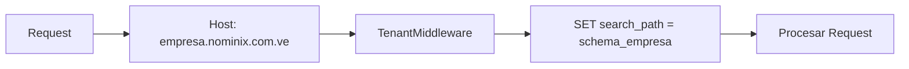
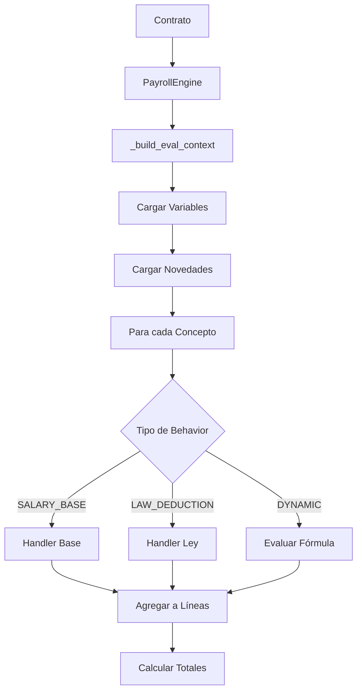
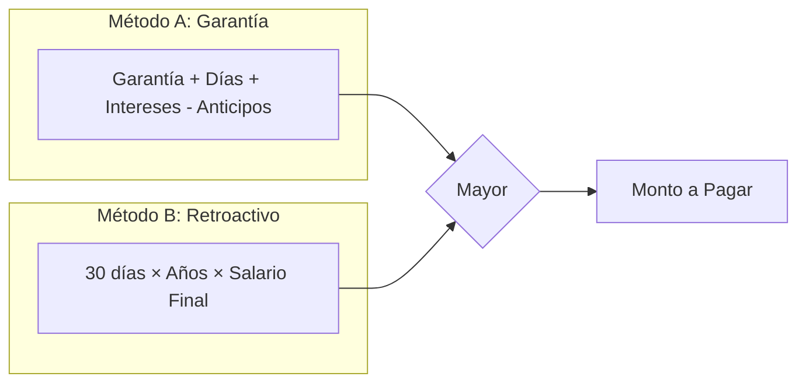

# 📘 Nóminix Suite — Documentación Técnica Principal

> Plataforma SaaS de Gestión de Nómina y Recursos Humanos para Venezuela
> **Versión:** 2.0.0 | **Última Actualización:** Enero 2026

---

## 📋 Índice de Documentación

### Documentos Principales

| Documento | Descripción |
|-----------|-------------|
| **📘 PROJECT_DOCUMENTATION.md** | Este documento - Vista general del sistema |
| [🏗️ ARCHITECTURE.md](./ARCHITECTURE.md) | Arquitectura del sistema y stack tecnológico |
| [⚙️ PAYROLL_ENGINE.md](./PAYROLL_ENGINE.md) | Motor de nómina, variables y fórmulas |
| [📊 SOCIAL_BENEFITS.md](./SOCIAL_BENEFITS.md) | Prestaciones Sociales (LOTTT Art. 142) |
| [💰 SALARY_ENGINEERING.md](./SALARY_ENGINEERING.md) | Ingeniería Salarial (SalarySplitter) |
| [🗃️ DATABASE_SCHEMA.md](./DATABASE_SCHEMA.md) | Esquema de base de datos y modelos |
| [🔌 API_DEVELOPER_GUIDE.md](./API_DEVELOPER_GUIDE.md) | Guía de integración API |
| [📄 openapi.yaml](./openapi.yaml) | Especificación OpenAPI 3.0 |

### Documentos Frontend

| Documento | Descripción |
|-----------|-------------|
| [🪝 hooks.md](./hooks.md) | Referencia de React Query hooks |
| [🎨 ui_components.md](./ui_components.md) | Componentes del sistema de diseño |

### Documentación de Tenants

| Documento | Descripción |
|-----------|-------------|
| [📋 tenants/README.md](./tenants/README.md) | Índice de tenants registrados |

---

## 🎯 Visión General

**Nóminix** es una plataforma SaaS multi-tenant diseñada específicamente para la gestión de nómina y recursos humanos en Venezuela, con cumplimiento total de la **LOTTT** (Ley Orgánica del Trabajo, los Trabajadores y las Trabajadoras).

### Características Principales

| Módulo | Funcionalidad |
|--------|---------------|
| **Empleados** | Registro, contratos laborales, datos bancarios |
| **Nómina** | Cálculo dinámico con fórmulas personalizables |
| **Prestaciones** | Garantía trimestral, días adicionales, intereses |
| **Préstamos** | Gestión y deducción automática |
| **Multi-Moneda** | Operación nativa USD/VES con tasa BCV |
| **Multi-Tenant** | Aislamiento por schema PostgreSQL |

---

## 🛠️ Stack Tecnológico

### Backend

```
Python 3.11+ / Django 5.x / Django REST Framework
PostgreSQL 15+ / django-tenants
simpleeval (fórmulas dinámicas)
WeasyPrint (generación PDF)
```

### Frontend

```
React 18 / Vite 5
TanStack Query 5 / React Hook Form 7
Axios / React Router 6
```

### Infraestructura

```
Docker / Docker Compose
Nginx / Gunicorn
Let's Encrypt (SSL)
```

---

## 📁 Estructura del Proyecto

```
c:\Desarrollo\RRHH\
├── config/                     # Configuración Django
│   ├── settings/
│   │   ├── base.py
│   │   ├── development.py
│   │   └── production.py
│   ├── urls.py
│   └── wsgi.py
├── customers/                  # App multi-tenancy
│   ├── models.py              # Tenant, Domain
│   └── views.py
├── payroll_core/              # App principal de nómina
│   ├── models/                # Modelos por dominio
│   │   ├── employee.py
│   │   ├── organization.py
│   │   ├── concepts.py
│   │   ├── payroll.py
│   │   ├── social_benefits.py
│   │   ├── loans.py
│   │   └── currency.py
│   ├── services/              # Lógica de negocio
│   │   ├── salary.py          # SalarySplitter
│   │   ├── payroll.py         # PayrollProcessor
│   │   ├── social_benefits_engine.py
│   │   └── currency.py        # BCVRateService
│   ├── engine.py              # PayrollEngine
│   ├── views.py               # API ViewSets
│   ├── serializers.py
│   └── urls.py
├── shared/                     # Modelos compartidos
├── templates/                  # Templates HTML
├── nominix-web/               # Frontend React
│   ├── src/
│   │   ├── api/
│   │   ├── components/
│   │   ├── features/
│   │   ├── hooks/
│   │   └── utils/
│   └── package.json
├── docs/                       # Documentación
├── docker-compose.yml
├── manage.py
└── requirements.txt
```

---

## 🔐 Multi-Tenancy

Nóminix implementa aislamiento de datos por **schema PostgreSQL** usando `django-tenants`.

### Flujo de Identificación



### Tablas Compartidas vs Aisladas

| Compartidas (public) | Aisladas (tenant_schema) |
|---------------------|--------------------------|
| Tenants & Domains | Empleados |
| Currencies | Contratos |
| Interest Rates BCV | Conceptos |
| | Periodos & Recibos |
| | Préstamos |
| | Prestaciones |

---

## ⚙️ Motor de Nómina (PayrollEngine)

El corazón del sistema es el `PayrollEngine`, un motor de reglas dinámicas basado en `simpleeval`.

### Flujo de Cálculo



### Variables Disponibles (Resumen)

| Variable | Descripción |
|----------|-------------|
| `SALARIO_MENSUAL` | Paquete total mensual (USD) |
| `SUELDO_BASE_MENSUAL` | Sueldo base sin complemento |
| `SUELDO_BASE_DIARIO` | Sueldo base / 30 |
| `COMPLEMENTO_MENSUAL` | Bono no salarial |
| `DIAS` | Días del periodo |
| `LUNES` | Cantidad de lunes (base IVSS) |
| `ANTIGUEDAD` | Años de servicio |
| `TASA` | Tasa BCV USD/VES |

> 📖 **Ver documentación completa:** [PAYROLL_ENGINE.md](./PAYROLL_ENGINE.md)

---

## 💰 Ingeniería Salarial

El sistema implementa "Salary Engineering" para optimizar cargas laborales.

### Modos de Distribución

| Modo | Descripción |
|------|-------------|
| `PERCENTAGE` | Base = Total × % configurado |
| `FIXED_BASE` | Base fija + Complemento variable |
| `FIXED_BONUS` | Complemento fijo + Base variable |

### Impacto

| Conceptos Afectados | Usa Base | Usa Total |
|---------------------|----------|-----------|
| IVSS, FAOV, RPE | ✅ | ❌ |
| Prestaciones Sociales | ✅ | ❌ |
| Utilidades | ✅ | ❌ |
| Bono Vacacional | ✅ | ❌ |

> 📖 **Ver documentación completa:** [SALARY_ENGINEERING.md](./SALARY_ENGINEERING.md)

---

## 📊 Prestaciones Sociales (LOTTT)

Módulo de cumplimiento con la LOTTT para cálculo de prestaciones.

### Transacciones del Libro Mayor

| Tipo | Frecuencia | Fórmula |
|------|------------|---------|
| `GARANTIA` | Trimestral | 15 días × Salario Integral |
| `DIAS_ADIC` | Anual | 2 días × (Años - 1), máx 30 |
| `INTERES` | Anual | Saldo × Tasa BCV |
| `ANTICIPO` | Variable | Monto solicitado |
| `LIQUIDACION` | Al terminar | max(Garantía, Retroactivo) |

### Liquidación Final (Art. 142)



> 📖 **Ver documentación completa:** [SOCIAL_BENEFITS.md](./SOCIAL_BENEFITS.md)

---

## 🔌 API REST

API RESTful construida con Django REST Framework.

### Autenticación

| Método | Uso |
|--------|-----|
| Session + CSRF | Frontend web |
| Token | Integraciones |

### Endpoints Principales

| Recurso | Endpoint | Métodos |
|---------|----------|---------|
| Empleados | `/api/employees/` | GET, POST, PUT, DELETE |
| Contratos | `/api/contracts/` | GET, POST, PUT, DELETE |
| Periodos | `/api/payroll-periods/` | GET, POST |
| Recibos | `/api/payroll-receipts/` | GET |
| Conceptos | `/api/payroll-concepts/` | GET, POST, PUT, DELETE |
| Novedades | `/api/payroll-novelties/` | GET, POST |
| Préstamos | `/api/loans/` | GET, POST |
| Prestaciones | `/api/social-benefits/ledger/` | GET |
| Tasas | `/api/exchange-rates/` | GET |

### Acciones Especiales

| Acción | Endpoint | Método |
|--------|----------|--------|
| Simular nómina | `/api/employees/{id}/simulate-payslip/` | GET/POST |
| Preview periodo | `/api/payroll-periods/{id}/preview-payroll/` | GET |
| Cerrar periodo | `/api/payroll-periods/{id}/close-period/` | POST |
| Exportar PDF | `/api/payroll-periods/{id}/export-pdf/` | GET |
| Sincronizar BCV | `/api/exchange-rates/sync-bcv/` | POST |

> 📖 **Ver documentación completa:** [API_DEVELOPER_GUIDE.md](./API_DEVELOPER_GUIDE.md)

---

## 🪝 Frontend Hooks

Hooks de TanStack Query para gestión de estado del servidor.

### Hooks por Dominio

| Dominio | Hook | Funcionalidad |
|---------|------|---------------|
| Empleados | `useEmployees(filters)` | Listar empleados |
| | `useEmployee(id)` | Obtener empleado |
| | `useSimulatePayslip(id)` | Simular nómina |
| Nómina | `usePayrollPeriods()` | Listar periodos |
| | `usePreviewPayroll(id)` | Preview de periodo |
| | `useClosePeriod()` | Cerrar periodo |
| Organización | `useBranches()` | Listar sedes |
| | `useDepartments(branchId)` | Departamentos |
| | `useJobPositions(deptId)` | Cargos |
| Prestaciones | `useSocialBenefitsLedger(empId)` | Histórico |
| | `useSettlementSimulation(empId)` | Simular liquidación |

> 📖 **Ver documentación completa:** [hooks.md](./hooks.md)

---

## 🎨 Componentes UI

Sistema de diseño basado en Atomic Design.

### Componentes Base

| Componente | Ubicación | Uso |
|------------|-----------|-----|
| `Button` | `components/ui/Button.jsx` | Botones con variantes |
| `Card` | `components/ui/Card.jsx` | Contenedores con sombra |
| `Modal` | `components/ui/Modal.jsx` | Diálogos modales |
| `Tabs` | `components/ui/Tabs.jsx` | Navegación por pestañas |
| `InputField` | `components/ui/InputField.jsx` | Campos de formulario |
| `SelectField` | `components/ui/SelectField.jsx` | Selectores |

> 📖 **Ver documentación completa:** [ui_components.md](./ui_components.md)

---

## 📝 Conceptos Clave

### Decimal Precision

> [!WARNING]
> **REGLA CRÍTICA**: NUNCA usar `float` para valores monetarios.

```python
# ✅ Correcto
from decimal import Decimal
salary = Decimal('500.00')
ivss = salary * Decimal('0.04')

# ❌ Incorrecto
salary = 500.00
ivss = salary * 0.04  # Errores de precisión
```

### Service Layer Pattern

La lógica de negocio reside **exclusivamente** en servicios:

```python
# ✅ Correcto - Vista delega a servicio
class EmployeeViewSet(viewsets.ModelViewSet):
    @action(detail=True, methods=['post'])
    def simulate_payslip(self, request, pk=None):
        engine = PayrollEngine(contract=...)
        return Response(engine.calculate_payroll())

# ❌ Incorrecto - Cálculos en la vista
class EmployeeViewSet(viewsets.ModelViewSet):
    @action(detail=True, methods=['post'])
    def simulate_payslip(self, request, pk=None):
        salary = employee.salary * 0.04  # NO
```

### Immutable Ledger

El `SocialBenefitsLedger` es inmutable:

```python
# Los registros NO se pueden modificar ni eliminar
# Las correcciones se hacen con transacciones REVERSAL
entry.save()  # Error si pk existe
entry.delete()  # Siempre error
```

---

## 🚀 Comandos de Desarrollo

### Backend

```powershell
# Activar entorno virtual
.\.venv\Scripts\Activate

# Migraciones
python manage.py makemigrations
python manage.py migrate_schemas --shared  # Tablas compartidas
python manage.py migrate_schemas           # Todos los schemas

# Servidor de desarrollo
python manage.py runserver

# Crear tenant
python manage.py create_tenant
```

### Frontend

```powershell
cd nominix-web

# Instalar dependencias
npm install

# Desarrollo
npm run dev

# Build producción
npm run build
```

### Docker

```powershell
# Levantar servicios
docker-compose up -d

# Ver logs
docker-compose logs -f backend

# Ejecutar management command
docker-compose exec backend python manage.py migrate_schemas
```

---

## 📞 Soporte

Para problemas técnicos o consultas sobre la documentación:

1. Revisar los documentos específicos listados en el índice
2. Consultar los comentarios en el código fuente
3. Contactar al equipo de desarrollo

---

## 📚 Enlaces Rápidos

- [Arquitectura del Sistema](./ARCHITECTURE.md)
- [Motor de Nómina](./PAYROLL_ENGINE.md)
- [Prestaciones Sociales](./SOCIAL_BENEFITS.md)
- [Ingeniería Salarial](./SALARY_ENGINEERING.md)
- [Esquema de Base de Datos](./DATABASE_SCHEMA.md)
- [Guía de API](./API_DEVELOPER_GUIDE.md)

---

*© 2026 NÓMINIX Suite — Documentación Técnica Principal V2.0.0*
