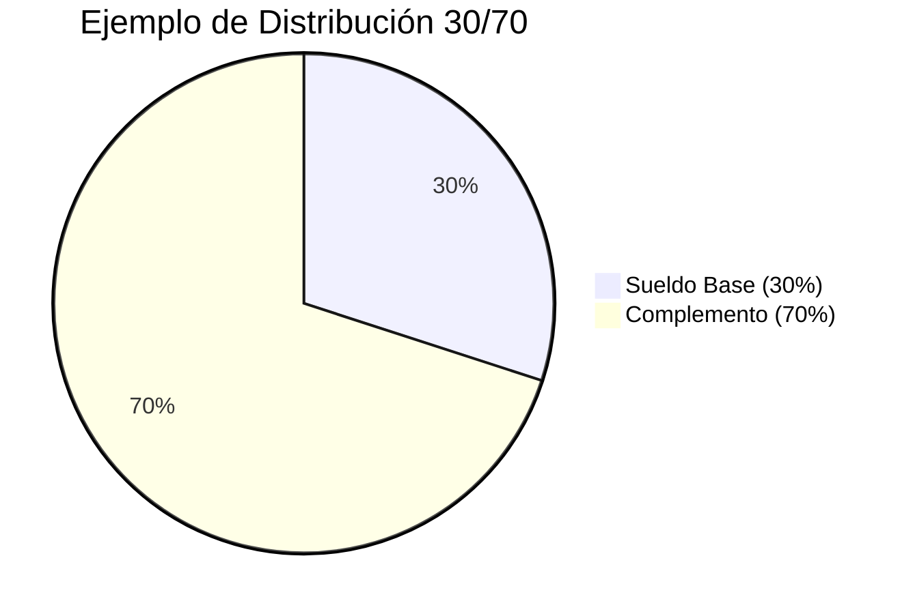
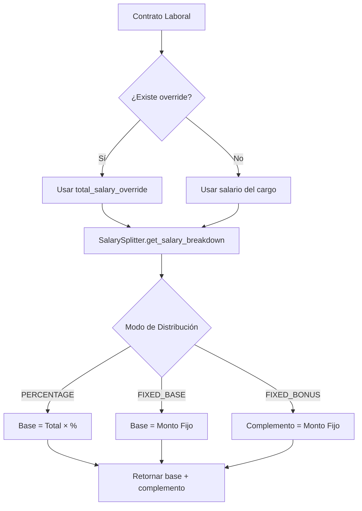
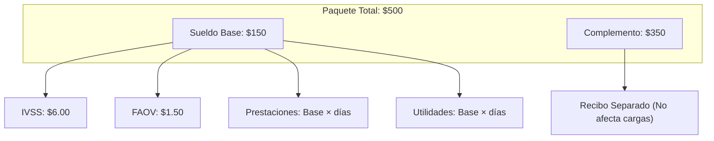

# 💰 Ingeniería Salarial (SalarySplitter) — Documentación Técnica

> Sistema de partición de salarios para optimización de cargas laborales según la legislación venezolana.
> **Versión:** 2.0.0 | **Última Actualización:** Enero 2026

---

## 📋 Índice

1. [Concepto](#concepto)
2. [Marco Legal](#marco-legal)
3. [Arquitectura](#arquitectura)
4. [Modos de Distribución](#modos-de-distribución)
5. [Configuración por Empresa](#configuración-por-empresa)
6. [Configuración por Cargo](#configuración-por-cargo)
7. [Impacto en Cálculos](#impacto-en-cálculos)
8. [API de Uso](#api-de-uso)
9. [Ejemplos Prácticos](#ejemplos-prácticos)

---

## Concepto

La **Ingeniería Salarial** (o *Salary Engineering*) es una estrategia de compensación que divide el paquete salarial total de un empleado en dos componentes:

| Componente | Naturaleza | Impacto Legal |
|------------|------------|---------------|
| **Sueldo Base** | Salarial | ✅ Afecta prestaciones, IVSS, FAOV, utilidades |
| **Complemento/Bono** | No Salarial | ❌ No afecta cargas laborales |

### Objetivo

Optimizar las cargas laborales del empleador manteniendo el paquete de compensación atractivo para el empleado.



---

## Marco Legal

### LOTTT - Consideraciones

La LOTTT define claramente qué conceptos son considerados **salario** y cuáles no:

| Concepto | Naturaleza | Artículo LOTTT |
|----------|------------|----------------|
| Sueldo/Jornal | Salarial | Art. 104 |
| Comisiones | Salarial | Art. 104 |
| Bonos regulares | Salarial | Art. 104 |
| Bonos ocasionales | No Salarial | Art. 105 |
| Viáticos | No Salarial | Art. 105 |
| Cestaticket | No Salarial | Ley de Cestaticket |

> [!WARNING]
> La configuración de la partición salarial debe ser revisada por un asesor legal para asegurar cumplimiento con la LOTTT y evitar contingencias laborales.

---

## Arquitectura

### Ubicación del Código

```
payroll_core/
├── services/
│   └── salary.py           # SalarySplitter (~180 líneas)
├── models/
│   └── organization.py     # Company.salary_split_mode
│   └── organization.py     # JobPosition.split_fixed_amount
└── engine.py               # Integración con PayrollEngine
```

### Diagrama de Flujo



---

## Modos de Distribución

La empresa puede configurar uno de tres modos de distribución salarial:

### 1. Modo PERCENTAGE (Porcentaje)

El sueldo base es **un porcentaje fijo** del total pactado.

```python
# Configuración
Company.salary_split_mode = 'PERCENTAGE'
Company.split_percentage_base = Decimal('30.00')  # 30%

# Cálculo
Total = 500.00 USD
Base = 500.00 × 0.30 = 150.00 USD
Complemento = 500.00 - 150.00 = 350.00 USD
```

**Ventajas:**
- Simple de configurar
- Escalable automáticamente con aumentos

**Desventajas:**
- Menos flexible por cargo

---

### 2. Modo FIXED_BASE (Base Fija)

El sueldo base es un **monto fijo** (definido por cargo), y el resto es complemento.

```python
# Configuración
Company.salary_split_mode = 'FIXED_BASE'
JobPosition.split_fixed_amount = Decimal('130.00')  # USD

# Cálculo
Total = 500.00 USD
Base = 130.00 USD (fija del cargo)
Complemento = 500.00 - 130.00 = 370.00 USD
```

**Ventajas:**
- Control preciso por cargo
- Base siempre igual al salario mínimo (si se desea)

**Desventajas:**
- Requiere configuración por cargo

---

### 3. Modo FIXED_BONUS (Complemento Fijo)

El complemento es un **monto fijo**, y el resto es base salarial.

```python
# Configuración
Company.salary_split_mode = 'FIXED_BONUS'
JobPosition.split_fixed_amount = Decimal('350.00')  # USD

# Cálculo
Total = 500.00 USD
Complemento = 350.00 USD (fija del cargo)
Base = 500.00 - 350.00 = 150.00 USD
```

**Ventajas:**
- Útil cuando el bono es el atractivo principal

**Desventajas:**
- Menos común en la práctica

---

## Configuración por Empresa

### Modelo Company

```python
class Company(models.Model):
    class SalarySplitMode(models.TextChoices):
        PERCENTAGE = 'PERCENTAGE', 'Porcentaje (Base = % del Total)'
        FIXED_BASE = 'FIXED_BASE', 'Base Fija + Complemento Variable'
        FIXED_BONUS = 'FIXED_BONUS', 'Complemento Fijo + Base Variable'
    
    salary_split_mode = models.CharField(
        max_length=15,
        choices=SalarySplitMode.choices,
        default=SalarySplitMode.PERCENTAGE,
        verbose_name="Modo de Distribución Salarial"
    )
    
    split_percentage_base = models.DecimalField(
        max_digits=5,
        decimal_places=2,
        default=Decimal('30.00'),
        verbose_name="Porcentaje Base (%)",
        help_text="Para modo PERCENTAGE: porcentaje del total que es sueldo base"
    )
```

### API de Configuración

```bash
# Obtener configuración actual
GET /api/company/config/

# Actualizar modo de distribución
PUT /api/company/config/
{
    "salary_split_mode": "FIXED_BASE",
    "split_percentage_base": 30.00
}
```

---

## Configuración por Cargo

### Modelo JobPosition

```python
class JobPosition(models.Model):
    split_fixed_amount = models.DecimalField(
        max_digits=12,
        decimal_places=2,
        default=Decimal('0.00'),
        verbose_name='Monto Fijo (Estrategia)',
        help_text='Monto fijo para usar en estrategias FIXED_BASE o FIXED_BONUS'
    )
    
    split_fixed_currency = models.ForeignKey(
        Currency,
        on_delete=models.PROTECT,
        default='USD',
        verbose_name='Moneda Monto Fijo'
    )
```

### Ejemplo de Configuración

| Cargo | Salario Total (USD) | split_fixed_amount | Base | Complemento |
|-------|---------------------|-------------------|------|-------------|
| Gerente | 800.00 | 200.00 | 200.00 | 600.00 |
| Analista | 500.00 | 150.00 | 150.00 | 350.00 |
| Asistente | 300.00 | 130.00 | 130.00 | 170.00 |

---

## Impacto en Cálculos

### Conceptos Afectados por la Base

| Concepto | Usa Base | Usa Total |
|----------|----------|-----------|
| IVSS (4%) | ✅ | ❌ |
| FAOV (1%) | ✅ | ❌ |
| RPE (0.5%) | ✅ | ❌ |
| INCES (2%) | ✅ | ❌ |
| Utilidades | ✅ | ❌ |
| Bono Vacacional | ✅ | ❌ |
| Prestaciones Sociales | ✅ | ❌ |
| Cestaticket | ❌ | ✅* |

> *El cestaticket es un monto fijo, no depende ni de base ni de total.

### Diagrama de Impacto



### Cálculo Comparativo

| Con Distribución 30/70 | Sin Distribución |
|------------------------|------------------|
| Salario Base: $150 | Salario Base: $500 |
| IVSS (4%): $6.00 | IVSS (4%): $20.00 |
| FAOV (1%): $1.50 | FAOV (1%): $5.00 |
| Prestaciones: Base × 15 días | Prestaciones: Total × 15 días |
| **Ahorro para empleador** | — |

---

## API de Uso

### Clase SalarySplitter

```python
from payroll_core.services.salary import SalarySplitter
from payroll_core.models import LaborContract
from decimal import Decimal

# Obtener contrato
contract = LaborContract.objects.get(pk=15)

# Obtener desglose
breakdown = SalarySplitter.get_salary_breakdown(
    contract=contract,
    exchange_rate=Decimal('55.75')  # Opcional, para conversión VES
)

# Resultado
# {
#     'base': Decimal('150.00'),
#     'complement': Decimal('350.00'),
#     'total': Decimal('500.00')
# }
```

### Método get_salary_breakdown

```python
@staticmethod
def get_salary_breakdown(
    contract: LaborContract,
    exchange_rate: Decimal = None
) -> Dict[str, Decimal]:
    """
    Calcula el desglose del salario para un contrato dado.
    
    Args:
        contract: Instancia de LaborContract.
        exchange_rate: Tasa de cambio USD->VES (opcional).
    
    Returns:
        Dict con claves:
            - 'base': Sueldo Base (USD)
            - 'complement': Bono/Complemento (USD)
            - 'total': Total calculado (USD)
    """
```

### Protección de Precisión VES

Cuando el monto fijo está en bolívares, el sistema protege la precisión:

```python
# Si split_fixed_currency == 'VES'
result = {
    'base': Decimal('2.69'),           # Convertido a USD
    'complement': Decimal('497.31'),
    'total': Decimal('500.00'),
    'base_ves_protected': Decimal('150.00')  # Valor original en VES
}
```

---

## Ejemplos Prácticos

### Ejemplo 1: Configuración Inicial

```python
from payroll_core.models import Company, JobPosition

# 1. Configurar modo de la empresa
company = Company.objects.first()
company.salary_split_mode = 'FIXED_BASE'
company.save()

# 2. Configurar monto fijo por cargo
cargo_gerente = JobPosition.objects.get(code='GER-001')
cargo_gerente.split_fixed_amount = Decimal('200.00')
cargo_gerente.split_fixed_currency = Currency.objects.get(code='USD')
cargo_gerente.save()
```

### Ejemplo 2: Uso en PayrollEngine

```python
from payroll_core.engine import PayrollEngine

# El motor usa SalarySplitter internamente
engine = PayrollEngine(contract=contract)
result = engine.calculate_payroll()

# El contexto tendrá:
# SUELDO_BASE_MENSUAL = 150.00 (del SalarySplitter)
# COMPLEMENTO_MENSUAL = 350.00
# SALARIO_MENSUAL = 500.00
```

### Ejemplo 3: Cambio de Estrategia

```python
from payroll_core.models import Company

company = Company.objects.first()

# Cambiar de porcentaje a base fija
company.salary_split_mode = 'FIXED_BASE'
company.save()

# Los nuevos cálculos usarán split_fixed_amount de cada cargo
# Los cálculos históricos NO se ven afectados (inmutables)
```

---

## Consideraciones Importantes

> [!IMPORTANT]
> ### Auditoría Legal
> La configuración de partición salarial debe:
> 1. Ser revisada por un abogado laboralista
> 2. Documentarse en los contratos de trabajo
> 3. Ser consistente con la realidad laboral

> [!WARNING]
> ### Riesgos
> Una configuración incorrecta puede resultar en:
> - Demandas laborales por diferencias de prestaciones
> - Sanciones por el Ministerio del Trabajo
> - Recálculo retroactivo de beneficios

> [!CAUTION]
> ### Limitaciones
> El sistema **no** debe usarse para:
> - Encubrir salarios reales
> - Evadir aportes obligatorios
> - Reducir ilegalmente prestaciones sociales

---

## Referencias

- **Código Fuente**: [salary.py](file:///c:/Desarrollo/RRHH/payroll_core/services/salary.py)
- **Modelo Company**: [organization.py](file:///c:/Desarrollo/RRHH/payroll_core/models/organization.py)
- **Modelo JobPosition**: [organization.py](file:///c:/Desarrollo/RRHH/payroll_core/models/organization.py)
- **LOTTT**: Artículos 104-105 (Definición de Salario)

---

*© 2026 NÓMINIX Suite — Documentación de Ingeniería Salarial*
