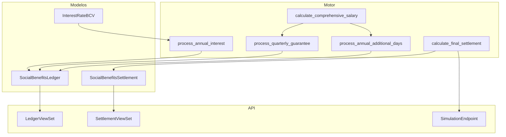
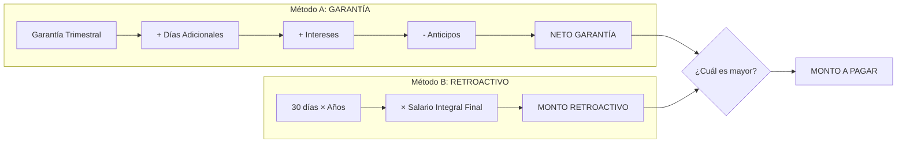

# 📊 Prestaciones Sociales (LOTTT Art. 142) — Documentación Técnica

> Módulo de cálculo y gestión de Prestaciones Sociales según la Ley Orgánica del Trabajo, los Trabajadores y las Trabajadoras (LOTTT) de Venezuela.
> **Versión:** 2.0.0 | **Última Actualización:** Enero 2026

---

## 📋 Índice

1. [Marco Legal](#marco-legal)
2. [Arquitectura del Módulo](#arquitectura-del-módulo)
3. [Salario Integral](#salario-integral)
4. [Garantía Trimestral](#garantía-trimestral)
5. [Días Adicionales por Antigüedad](#días-adicionales-por-antigüedad)
6. [Intereses sobre Saldo](#intereses-sobre-saldo)
7. [Liquidación Final](#liquidación-final)
8. [Modelo de Libro Mayor (Ledger)](#modelo-de-libro-mayor)
9. [API Endpoints](#api-endpoints)
10. [Ejemplos de Uso](#ejemplos-de-uso)

---

## Marco Legal

### LOTTT - Artículos Relevantes

| Artículo | Título | Contenido |
|----------|--------|-----------|
| **Art. 122** | Salario Integral | Define el salario integral como: Salario Normal + Alícuota Utilidades + Alícuota Bono Vacacional |
| **Art. 131** | Utilidades | Mínimo 30 días anuales (máximo 120 días) |
| **Art. 142** | Prestaciones Sociales | Garantía trimestral (15 días) + Días adicionales por antigüedad |
| **Art. 143** | Intereses | Intereses anuales sobre saldo acumulado (tasa activa BCV) |
| **Art. 192** | Bono Vacacional | Mínimo 15 días (incrementa con antigüedad) |

### Tabla de Constantes Legales

```python
# Ubicación: payroll_core/services/social_benefits_engine.py

DIAS_UTILIDADES_MINIMO = Decimal('30')       # Art. 131
DIAS_BONO_VACACIONAL_BASE = Decimal('15')    # Art. 192
DIAS_GARANTIA_TRIMESTRE = Decimal('15')      # Art. 142
DIAS_ADICIONALES_POR_ANIO = Decimal('2')     # Art. 142
MAX_DIAS_ADICIONALES_ANIO = Decimal('30')    # Tope
DIAS_RETROACTIVO_POR_ANIO = Decimal('30')    # Art. 142 literal d
```

---

## Arquitectura del Módulo

### Estructura de Archivos

```
payroll_core/
├── models/
│   └── social_benefits.py     # Modelos Ledger y Settlement
├── services/
│   └── social_benefits_engine.py  # Motor de cálculo (~660 líneas)
├── serializers.py             # Serializers para API
└── views.py                   # ViewSets y endpoints
```

### Diagrama de Componentes



---

## Salario Integral

El **Salario Integral Diario** es la base para todos los cálculos de prestaciones sociales.

### Fórmula (Art. 122 LOTTT)

```
Salario Integral = Salario Normal + Alícuota Utilidades + Alícuota Bono Vacacional
```

### Componentes

| Componente | Fórmula | Ejemplo |
|------------|---------|---------|
| **Salario Diario** | Salario Mensual ÷ 30 | 500 ÷ 30 = 16.67 |
| **Alícuota Utilidades** | (Salario Mensual × Días Utilidades) ÷ 360 | (500 × 30) ÷ 360 = 41.67 |
| **Alícuota Bono Vacacional** | (Salario Mensual × Días Bono) ÷ 360 | (500 × 15) ÷ 360 = 20.83 |
| **Salario Integral Diario** | 16.67 + 41.67 + 20.83 | **79.17 USD** |

### Función de Cálculo

```python
from payroll_core.services import calculate_comprehensive_salary

result = calculate_comprehensive_salary(
    contract=contract,
    calculation_date=date(2026, 1, 15),
    dias_utilidades=Decimal('30'),      # Opcional, default: 30
    dias_bono_vacacional=Decimal('15')  # Opcional, default: 15
)

# Resultado:
# {
#     'monthly_salary': Decimal('500.00'),
#     'daily_salary': Decimal('16.67'),
#     'aliquot_utilidades': Decimal('41.67'),
#     'aliquot_bono_vacacional': Decimal('20.83'),
#     'daily_salary_integral': Decimal('79.17')
# }
```

---

## Garantía Trimestral

Cada **trimestre** el empleador debe abonar **15 días de salario integral** a las prestaciones sociales del trabajador.

### Calendario de Abonos

| Trimestre | Período | Fecha de Abono |
|-----------|---------|----------------|
| Q1 | Enero - Marzo | 31 de Marzo |
| Q2 | Abril - Junio | 30 de Junio |
| Q3 | Julio - Septiembre | 30 de Septiembre |
| Q4 | Octubre - Diciembre | 31 de Diciembre |

### Fórmula

```
Abono Trimestral = 15 días × Salario Integral Diario
```

### Función de Procesamiento

```python
from payroll_core.services import process_quarterly_guarantee

ledger_entry = process_quarterly_guarantee(
    contract=contract,
    transaction_date=date(2026, 3, 31),
    period_description='Q1-2026',
    created_by='admin',
    notes='Abono automático primer trimestre'
)

# Crea un registro en SocialBenefitsLedger:
# - transaction_type: GARANTIA
# - basis_days: 15
# - daily_salary_used: 79.17
# - amount: 1187.55 (15 × 79.17)
# - balance: saldo anterior + 1187.55
```

---

## Días Adicionales por Antigüedad

A partir del **segundo año de servicio**, el trabajador adquiere derecho a **2 días adicionales por cada año de antigüedad**, con un tope de **30 días adicionales por año**.

### Tabla de Acumulación

| Años de Servicio | Días Adicionales | Días Acumulados |
|------------------|------------------|-----------------|
| 1 | 0 | 0 |
| 2 | 2 | 2 |
| 3 | 4 | 6 |
| 4 | 6 | 12 |
| 5 | 8 | 20 |
| 10 | 18 | **30 (tope)** |
| 15+ | 30 | **30 (tope)** |

### Función de Cálculo

```python
from payroll_core.services import process_annual_additional_days

ledger_entry = process_annual_additional_days(
    contract=contract,
    transaction_date=date(2026, 1, 15),
    period_description='Año 2025',
    created_by='admin'
)

# Si el empleado tiene 5 años de antigüedad:
# - basis_days: 8 (2 × 4 años después del primero)
# - amount: 8 × 79.17 = 633.36
```

### Algoritmo

```python
def calculate_additional_days(years_of_service: int) -> Decimal:
    if years_of_service <= 1:
        return Decimal('0')
    
    additional_years = years_of_service - 1
    days = Decimal('2') * additional_years
    
    return min(days, Decimal('30'))  # Tope máximo
```

---

## Intereses sobre Saldo

Los intereses se calculan **anualmente** sobre el saldo acumulado de prestaciones, utilizando la **tasa activa promedio del BCV**.

### Fórmula

```
Interés Anual = Saldo Acumulado × (Tasa Promedio BCV / 100)
```

### Modelo de Tasa BCV

```python
class InterestRateBCV(models.Model):
    """Tasa de interés del BCV por mes."""
    year = models.PositiveIntegerField()
    month = models.PositiveSmallIntegerField()
    rate = models.DecimalField(max_digits=6, decimal_places=4)
    
    # Ejemplo: Enero 2026, tasa 15.50%
```

### Función de Procesamiento

```python
from payroll_core.services import process_annual_interest

ledger_entry = process_annual_interest(
    contract=contract,
    transaction_date=date(2026, 1, 15),
    year=2025,
    created_by='admin'
)

# Si saldo = 5000.00 y tasa promedio = 15.00%:
# - interest_rate_used: 15.00
# - amount: 5000.00 × 0.15 = 750.00
```

---

## Liquidación Final

Al terminar la relación laboral, se comparan **dos métodos** y se paga **el mayor**:

### Método A: Garantía (Art. 142 literal c)

```
Neto Garantía = Total Garantía + Total Días Adicionales + Total Intereses - Anticipos
```

### Método B: Retroactivo (Art. 142 literal d)

```
Monto Retroactivo = 30 días × Años de Servicio × Salario Integral Diario Final
```

### Comparación Visual



### Función de Cálculo

```python
from payroll_core.services import calculate_final_settlement

comparison = calculate_final_settlement(
    contract=contract,
    termination_date=date(2026, 1, 15)
)

# Resultado:
# {
#     # Método A
#     'total_garantia': Decimal('4750.00'),
#     'total_dias_adicionales': Decimal('1266.72'),
#     'total_intereses': Decimal('900.00'),
#     'total_anticipos': Decimal('500.00'),
#     'net_garantia': Decimal('6416.72'),
#     
#     # Método B
#     'years_of_service': Decimal('5.25'),
#     'retroactive_days': Decimal('157.50'),
#     'final_daily_salary': Decimal('85.00'),
#     'retroactive_amount': Decimal('13387.50'),
#     
#     # Resultado
#     'chosen_method': 'RETROACTIVO',
#     'settlement_amount': Decimal('13387.50'),
#     'calculation_summary': '...'
# }
```

---

## Modelo de Libro Mayor

El `SocialBenefitsLedger` implementa un **libro mayor inmutable** con reglas estrictas de auditoría.

### Reglas de Inmutabilidad

1. **Los registros NUNCA se modifican** después de crearse
2. **Los registros NUNCA se eliminan**
3. Las correcciones se hacen mediante **transacciones de REVERSAL**

### Tipos de Transacción

```python
class TransactionType(models.TextChoices):
    GARANTIA = 'GARANTIA', 'Garantía Trimestral (15 días)'
    DIAS_ADIC = 'DIAS_ADIC', 'Días Adicionales por Antigüedad'
    INTERES = 'INTERES', 'Intereses sobre Saldo Acumulado'
    ANTICIPO = 'ANTICIPO', 'Anticipo de Prestaciones'
    LIQUIDACION = 'LIQUIDACION', 'Liquidación Final'
    REVERSAL = 'REVERSAL', 'Reversión/Contraasiento'
```

### Campos del Libro Mayor

| Campo | Tipo | Descripción |
|-------|------|-------------|
| `employee` | FK | Empleado propietario |
| `contract` | FK | Contrato vigente al momento |
| `transaction_type` | Choice | Tipo de movimiento |
| `transaction_date` | Date | Fecha del movimiento |
| `basis_days` | Decimal | Días base del cálculo |
| `daily_salary_used` | Decimal | Salario integral usado |
| `interest_rate_used` | Decimal | Tasa de interés (si aplica) |
| `previous_balance` | Decimal | Saldo antes del movimiento |
| `amount` | Decimal | Monto de la transacción |
| `balance` | Decimal | Saldo después del movimiento |
| `calculation_formula` | String | Fórmula aplicada |
| `calculation_trace` | Text | Fórmula expandida con valores |
| `created_by` | String | Usuario que creó el registro |
| `ip_address` | IP | IP de origen |

### Bloqueo de Modificaciones

```python
class SocialBenefitsLedger(models.Model):
    def save(self, *args, **kwargs):
        if self.pk:  # Ya existe en BD
            raise ValueError(
                "Los registros del Ledger son INMUTABLES. "
                "Para corregir, cree una transacción de tipo REVERSAL."
            )
        super().save(*args, **kwargs)
    
    def delete(self, *args, **kwargs):
        raise ValueError(
            "Los registros del Ledger NO pueden eliminarse. "
            "Para anular, cree una transacción de tipo REVERSAL."
        )
```

---

## API Endpoints

### Endpoints Disponibles

| Método | Endpoint | Descripción |
|--------|----------|-------------|
| GET | `/api/social-benefits/ledger/` | Listar movimientos |
| GET | `/api/social-benefits/ledger/?employee={id}` | Movimientos por empleado |
| POST | `/api/social-benefits/process-quarterly/` | Procesar garantía trimestral |
| POST | `/api/social-benefits/process-additional-days/` | Procesar días adicionales |
| POST | `/api/social-benefits/process-interest/` | Procesar intereses anuales |
| POST | `/api/social-benefits/settlement-simulation/` | Simular liquidación |
| POST | `/api/social-benefits/settlements/` | Crear liquidación |
| GET | `/api/social-benefits/settlements/` | Listar liquidaciones |
| GET | `/api/interest-rates/` | Tasas BCV registradas |

### Ejemplo: Simular Liquidación

```bash
curl -X POST https://tenant.nominix.com.ve/api/social-benefits/settlement-simulation/ \
  -H "Content-Type: application/json" \
  -b cookies.txt \
  -d '{
    "employee_id": 123,
    "termination_date": "2026-01-15"
  }'
```

### Respuesta

```json
{
  "total_garantia": "4750.00",
  "total_dias_adicionales": "1266.72",
  "total_intereses": "900.00",
  "total_anticipos": "500.00",
  "net_garantia": "6416.72",
  "years_of_service": "5.25",
  "retroactive_days": "157.50",
  "final_daily_salary": "85.00",
  "retroactive_amount": "13387.50",
  "chosen_method": "RETROACTIVO",
  "settlement_amount": "13387.50"
}
```

---

## Ejemplos de Uso

### Ejemplo 1: Procesar Trimestre Completo

```python
from payroll_core.models import LaborContract
from payroll_core.services import (
    process_quarterly_guarantee,
    process_annual_additional_days
)
from datetime import date

# Obtener todos los contratos activos
contracts = LaborContract.objects.filter(is_active=True)

for contract in contracts:
    # Procesar garantía Q1-2026
    process_quarterly_guarantee(
        contract=contract,
        transaction_date=date(2026, 3, 31),
        period_description='Q1-2026',
        created_by='batch_process'
    )
    
    # Si cumple aniversario, procesar días adicionales
    if contract.employee.hire_date.month == 3:
        process_annual_additional_days(
            contract=contract,
            transaction_date=date(2026, 3, 31),
            period_description='Aniversario 2026',
            created_by='batch_process'
        )
```

### Ejemplo 2: Consultar Saldo Actual

```python
from payroll_core.services import get_current_balance
from payroll_core.models import Employee

employee = Employee.objects.get(national_id='V-12345678')
balance = get_current_balance(employee)

print(f"Saldo de prestaciones: {balance} USD")
```

### Ejemplo 3: Generar Liquidación

```python
from payroll_core.services import create_settlement_record
from payroll_core.models import LaborContract
from datetime import date

contract = LaborContract.objects.get(
    employee__national_id='V-12345678',
    is_active=True
)

settlement = create_settlement_record(
    contract=contract,
    termination_date=date(2026, 1, 15),
    created_by='rrhh_manager',
    notes='Renuncia voluntaria'
)

print(f"Método seleccionado: {settlement.chosen_method}")
print(f"Monto a pagar: {settlement.settlement_amount}")
```

---

## Referencias

- **Código Fuente**: [social_benefits_engine.py](file:///c:/Desarrollo/RRHH/payroll_core/services/social_benefits_engine.py)
- **Modelos**: [social_benefits.py](file:///c:/Desarrollo/RRHH/payroll_core/models/social_benefits.py)
- **LOTTT**: Ley Orgánica del Trabajo, los Trabajadores y las Trabajadoras (2012)

---

*© 2026 NÓMINIX Suite — Documentación del Módulo de Prestaciones Sociales*
