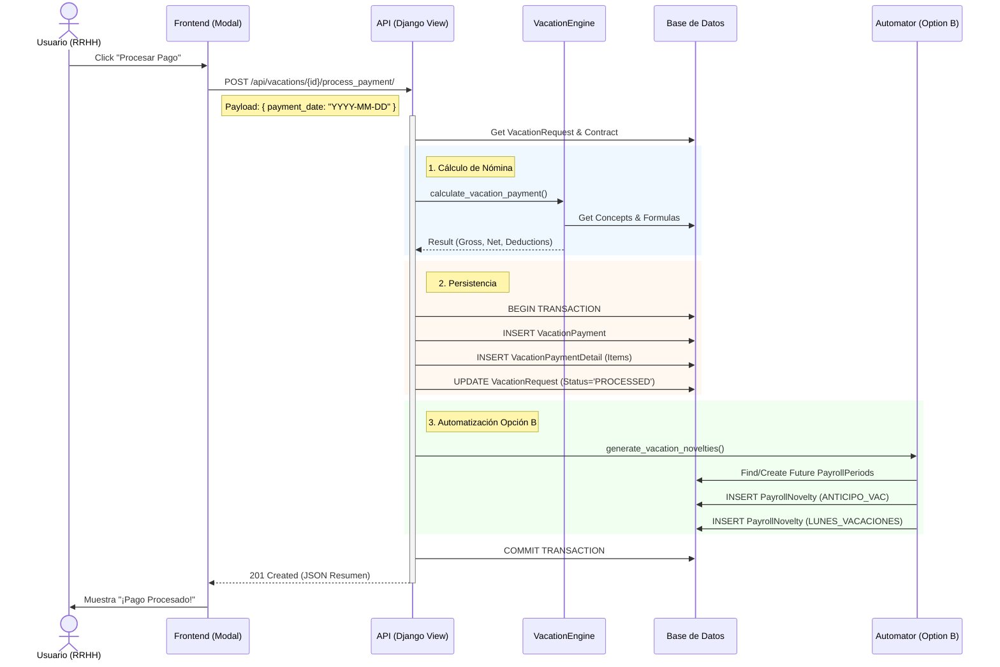

# Flujo de Procesamiento de Pago de Vacaciones

Este documento detalla el flujo técnico extremo a extremo que ocurre cuando un usuario hace clic en el botón **"Procesar Pago"** dentro del módulo de vacaciones.

## Diagrama Visual

## Diagrama de Secuencia (Técnico)

## Detalle Técnico del Proceso

### 1. Frontend: Disparo de la Acción
*   **Archivo**: `VacationPaymentModal.jsx`
*   **Evento**: `onClick={handleProcessPayment}`
*   **Servicio**: Llamada a `vacationService.processPayment(requestId, paymentDate)`

### 2. Backend: Recepción (API View)
*   **Archivo**: `vacations/views.py`
*   **Método**: `VacationRequestViewSet.process_payment`
*   **Acción**:
    1.  Recibe el `POST`.
    2.  Valida que la solicitud exista y esté en estado `APPROVED`.
    3.  Abre una transacción atómica de base de datos (`transaction.atomic()`).

### 3. Motor de Cálculo (Calculation Engine)
*   **Archivo**: `vacations/services/vacation_calculator.py`
*   **Función**: `VacationEngine.calculate_vacation_payment`

### 4. Persistencia en Base de Datos
1.  **Tabla `VacationPayment`**: Registro maestro.
2.  **Tabla `VacationPaymentDetail`**: Detalles por concepto.
3.  **Tabla `VacationRequest`**: Estado a `'PROCESSED'`.

### 5. Automatización "Opción B" (Novedades Futuras)
*   **Archivo**: `vacations/services/vacation_novelties.py`
*   **Función**: `generate_vacation_novelties`
*   **Lógica**: Inserta `ANTICIPO_VAC` y `LUNES_VACACIONES` en periodos futuros.

### 6. Finalización
*   `COMMIT` de la transacción.
*   Retorna respuesta HTTP `201 Created`.
